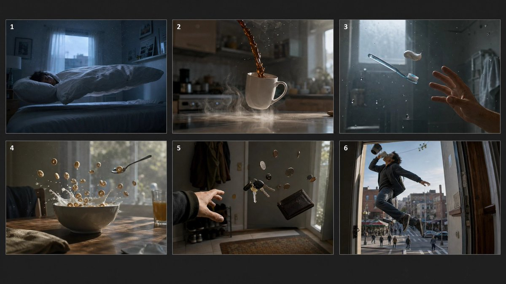

# 🧪 Comparaisons et Exemples de la Communaute

> Part of [awesome-gpt-image-2-prompts](../README_fr.md)

### Case 5: [Wooden Bookshelf Prompt Test](https://x.com/chetaslua/status/2044331451077013749) (by [@chetaslua](https://x.com/chetaslua))

| Resultat |
| :----: |
| <a href="https://evolink.ai/gpt-image-2-prompts?utm_source=github&utm_medium=picture&utm_campaign=awesome-gpt-image-2-prompts" target="_blank" rel="noopener noreferrer"></a> |

**Prompt：**

```
A wooden bookshelf consisting of three shelves: On the top shelf, there should be one book, on the second shelf, there should be three books, and on the bottom shelf, there should be seven books.
```


### Case 10: [GPT-Image-2 Detail Showcase](https://x.com/liyue_ai/status/2045000106919997637) (by [@liyue_ai](https://x.com/liyue_ai))

| Resultat |
| :----: |
| <a href="https://evolink.ai/gpt-image-2-prompts?utm_source=github&utm_medium=picture&utm_campaign=awesome-gpt-image-2-prompts" target="_blank" rel="noopener noreferrer"></a> |

**Prompt：**

```
以眼部特写图片为基础，生成3:4的四屏构图超写实眼部特写，四屏按春夏秋冬上下排序。

第一屏：眼眸中带着绽粉樱色的美瞳，睫毛缀满迷你春花，脸颊散落樱瓣与黄蕊小花，粉蝶萦绕眉眼，浅金发丝轻垂，下方簇簇樱花怒放，画面中央"SPRING"白色艺术字点缀，风格细腻唯美，光影柔和，色彩粉嫩治愈，下面用书法体写着春；

第二屏：眼眸中带着着清荷色的美瞳，睫毛饰以粉莲与绿荷，脸颊挂着晶莹水珠，粉瓣、绿荷点缀其间，蜻蜓轻绕，浅金发丝若隐若现，画面中央"Summer"白色艺术字凸显，光影通透流光感，色彩清透凉爽，下面用书法体写着夏；

第三屏：眼眸中带着金黄红相间的美瞳，睫毛饰以橙红枫叶，脸颊散落金红秋叶，橙蝶翩跹眉眼间，浅金发丝隐约可见，画面中央"AUTUMN"白色艺术字醒目，光影暖金流光，色彩浓郁温暖，下面用书法笔写着秋；

第四屏：眼眸中带着雪花蓝色的美瞳，睫毛覆满冰晶雪片，脸颊散落白色雪花与红色腊梅，银白蝴蝶翩跹眉眼，浅金发丝朦胧似雪，画面中央"WINTER"白色艺术字亮眼，光影冷冽蓝白流光，色彩清透纯净，下面用书法体写着冬。

整体呈现梦幻眼眸四季交替的唯美梦幻治愈画面，微调各屏的光影强度，让画面氛围感更浓郁。
```


### Case 16: [A/B Test Signed Output](https://x.com/saskr_13/status/2044744396932079934) (by [@saskr_13](https://x.com/saskr_13))

| Resultat |
| :----: |
| <a href="https://evolink.ai/gpt-image-2-prompts?utm_source=github&utm_medium=picture&utm_campaign=awesome-gpt-image-2-prompts" target="_blank" rel="noopener noreferrer"></a> |

**Prompt：**

```
私があなたをどんなふうに扱ってきたか、4 コマ漫画風に描いてください。まずは 800 字くらいのプロットをテキストで出して、私が「描いて」と言ったらプロットに沿った 4 コマ漫画を描いてください。
```


### Case 23: [Silhouette Universe Narrative Poster](https://x.com/MrLarus/status/2045418028733538620) (by [@MrLarus](https://x.com/MrLarus))

| Resultat |
| :----: |
| <a href="https://evolink.ai/gpt-image-2-prompts?utm_source=github&utm_medium=picture&utm_campaign=awesome-gpt-image-2-prompts" target="_blank" rel="noopener noreferrer"></a> |

**Prompt：**

```
请根据【主题：xxx】自动生成一张高审美的“轮廓宇宙 / 收藏版叙事海报”风格作品。不要将画面局限于固定器物或常见容器，不要优先默认瓶子、沙漏、玻璃罩、怀表之类的常规载体，而是由 AI 根据主题自行判断并选择一个最契合、最有象征意义、轮廓最强、最适合承载完整叙事世界的主轮廓载体。这个主轮廓可以是器物、建筑、门、塔、拱门、穹顶、楼梯井、长廊、雕像、侧脸、眼睛、手掌、头骨、羽翼、面具、镜面、王座、圆环、裂缝、光幕、阴影、几何结构、空间切面、舞台框景、抽象符号或其他更有创意与主题代表性的视觉轮廓，要求合理布局。优先选择最能放大主题气质、最能形成强烈视觉记忆点、最能体现史诗感、神秘感、诗意感或设计感的轮廓，而不是最安全、最普通、最常见的容器。

画面的核心不是简单把世界装进某个物体里，而是让完整的主题世界自然生长在这个主轮廓之中、之内、之上、之边界里或与其结构融为一体，形成一种“主题宇宙依附于一个象征性轮廓展开”的高级叙事效果。主轮廓必须清晰、优雅、有辨识度，并在整体构图中占据核心地位。轮廓内部或边界中需要自动生成与主题强绑定的完整叙事世界，内容应当丰富、饱满、层次清晰，包括最能代表主题的标志性场景、核心建筑或空间结构、象征符号与隐喻元素、角色关系或文明痕迹、远景中景近景的空间递进、具有命运感和情绪张力的氛围层次，以及门、台阶、桥梁、水面、烟雾、路径、光源、遗迹、机械结构、自然景观、抽象形态、生物或道具等叙事细节。所有元素必须统一、自然、有主次、有层级地融合，像一个完整世界真实孕育在这个轮廓结构之中，而不是简单拼贴、裁切填充、素材堆叠或模板化背景。

整体构图需要具有强烈的收藏版海报气质与高级设计感，大结构稳定，主轮廓强烈明确，内部世界具有纵深、秩序和呼吸感，细节丰富但不拥挤，内容丰满但不杂乱，可以适度加入小比例人物剪影、远处建筑、光柱、门洞、桥、阶梯、回廊、倒影、天光或远景结构来增强尺度感、故事感与史诗感。整体画面要安静、宏大、凝练、富有余味，不要平均铺满，不要廉价热闹，不要无重点堆砌。

风格融合收藏版电影海报构图、高级叙事型视觉设计、梦幻水彩质感与纸张印刷品气质，强调纸张颗粒感、边缘飞白、水彩刷痕、轻微晕染、空气透视、柔和雾化、局部体积光、光雾穿透、大面积留白与克制版式，让画面看起来像设计师完成的高端收藏版视觉作品，而不是普通 AI 跑图。整体气质要高级、诗意、宏大、神圣、怀旧、安静、具有传说感和叙事感。

色彩由 AI 根据主题自动判断并匹配最合适的高级配色方案，但必须保持统一、克制、耐看、低饱和、高级，不要杂乱高饱和，不要廉价霓虹感，不要塑料数码感。配色可以围绕黑金灰、冷蓝灰、雾白灰、褐红米白、暗铜、旧纸色、深海蓝、暮色紫、银灰等体系自由变化，但必须始终服务主题，并保持海报级审美与整体和谐。

最终要求：第一眼有强烈的主题识别度和轮廓记忆点，第二眼有完整丰富的叙事世界，第三眼仍有细节和余味。轮廓选择必须具有创意和主题匹配度，尽量避免重复、保守、常见的容器套路，优先选择更有象征性、更有空间感、更有设计潜力的轮廓形式。不要普通背景拼接，不要生硬裁切，不要模板化奇幻素材，不要游戏宣传图感，不要过度卡通化，不要过度写实导致失去艺术感，不要形式大于内容。如果合适，可以自然加入低调克制的标题、编号、签名或落款，让它更像收藏版海报设计的一部分，但不要喧宾夺主。
```

### Case 29: [Lion Camel Ridge Dark Myth Scene](https://x.com/MANISH1027512/status/2045743158860878312) (by [@MANISH1027512](https://x.com/MANISH1027512))

| Resultat |
| :----: |
| <a href="https://evolink.ai/gpt-image-2-prompts?utm_source=github&utm_medium=picture&utm_campaign=awesome-gpt-image-2-prompts" target="_blank" rel="noopener noreferrer"></a> |

**Prompt：**

```
中式怪异，黑暗神秘风格融合中式美学，完美细节，多重管线渲染，完美建模。西游记背景，狮驼岭，千妖万怪，坐在左边巨大王座上的大象王重甲妖精，坐在中间巨大王座上的狮王重甲妖精，坐在右边巨大王座上大鹏鸟王重甲妖精。渺小的背对镜头孙悟空肩抗金箍棒步行前进，孙悟空身穿铠甲，近地仰拍镜头，长焦镜头，强烈阴影。极致细节刻画，多次修改，正确透视和主体线条，精致细节
```

### Case 30: [Counter-Strike x Terraria Screenshot Mashup](https://x.com/yssrski/status/2046410519595348397) (by [@yssrski](https://x.com/yssrski))

| Resultat |
| :----: |
| <a href="https://evolink.ai/gpt-image-2-prompts?utm_source=github&utm_medium=picture&utm_campaign=awesome-gpt-image-2-prompts" target="_blank" rel="noopener noreferrer"></a> |

**Prompt：**

```
counter strike in game screenshot, mixed with Terraria
```

### Case 31: [Pre-war Japan Lab Minecraft Screenshot](https://x.com/RitaStar1128/status/2046406024303976904) (by [@RitaStar1128](https://x.com/RitaStar1128))

| Resultat |
| :----: |
| <a href="https://evolink.ai/gpt-image-2-prompts?utm_source=github&utm_medium=picture&utm_campaign=awesome-gpt-image-2-prompts" target="_blank" rel="noopener noreferrer"></a> |

**Prompt：**

```
戦前日本の怪しげな研究所を探検しているマイクラのスクリーンショット画像を作成して
```

### Case 32: [Forged Masterpiece Prompt Test](https://x.com/MrLarus/status/2046201836525302032) (by [@MrLarus](https://x.com/MrLarus))

| Resultat |
| :----: |
| <a href="https://evolink.ai/gpt-image-2-prompts?utm_source=github&utm_medium=picture&utm_campaign=awesome-gpt-image-2-prompts" target="_blank" rel="noopener noreferrer"></a> |

**Prompt：**

```
帮我生成xxxx真迹图片
```

### Case 33: [Multi-Concept Battle Poster Set](https://x.com/joshesye/status/2046493442428039212) (by [@joshesye](https://x.com/joshesye))

| Resultat |
| :----: |
| <a href="https://evolink.ai/gpt-image-2-prompts?utm_source=github&utm_medium=picture&utm_campaign=awesome-gpt-image-2-prompts" target="_blank" rel="noopener noreferrer"></a> |

**Prompt：**

```
1、生成不知火舞和貂蝉的游戏对战海报图
2、生成一张K-pop团体时尚专辑封面
3、请你生成 《斗破苍穹》 的关键人物关系图
4、帮我截一张上传图片的抖音首页的女网红图
```

### Case 34: [Rust In-Game Screenshot](https://x.com/FixlationAI/status/2046272578705068476) (by [@FixlationAI](https://x.com/FixlationAI))

| Resultat |
| :----: |
| <a href="https://evolink.ai/gpt-image-2-prompts?utm_source=github&utm_medium=picture&utm_campaign=awesome-gpt-image-2-prompts" target="_blank" rel="noopener noreferrer"></a> |

**Prompt：**

```
an ingame screenshot of rust
```

### Case 35: [Sam Altman Bear Selfie](https://x.com/JustinGorya/status/2046510831832006970) (by [@JustinGorya](https://x.com/JustinGorya))

| Resultat |
| :----: |
| <a href="https://evolink.ai/gpt-image-2-prompts?utm_source=github&utm_medium=picture&utm_campaign=awesome-gpt-image-2-prompts" target="_blank" rel="noopener noreferrer"></a> |

**Prompt：**

```
generate image: Selfie of Sam Altman riding a bear

Edit prompt: Remove the background make it transparent
```

### Case 36: [Among Us Realistic Screenshot](https://x.com/ReYYYYoking/status/2046502217843376292) (by [@ReYYYYoking](https://x.com/ReYYYYoking))

| Resultat |
| :----: |
| <a href="https://evolink.ai/gpt-image-2-prompts?utm_source=github&utm_medium=picture&utm_campaign=awesome-gpt-image-2-prompts" target="_blank" rel="noopener noreferrer"></a> |

**Prompt：**

```
AmongUsの精密な実際のゲーム画像を生成して
```

### Case 37: [Retro Programming Museum Cartoon](https://x.com/XiaohuiAI666/status/2046515319947354603) (by [@XiaohuiAI666](https://x.com/XiaohuiAI666))

| Resultat |
| :----: |
| <a href="https://evolink.ai/gpt-image-2-prompts?utm_source=github&utm_medium=picture&utm_campaign=awesome-gpt-image-2-prompts" target="_blank" rel="noopener noreferrer"></a> |

**Prompt：**

```
在计算机博物馆里,一个程序员在展厅中央,正在演示C语言编程,很多参观者在围观,屏幕上的代码清晰可见。旁边的牌子写着:古法编程,现场表演。2D卡通画风,16:9
```

### Case 38: [14th-Dimension Projection Scene](https://x.com/workingclassbud/status/2046506783850815703) (by [@workingclassbud](https://x.com/workingclassbud))

| Resultat |
| :----: |
| <a href="https://evolink.ai/gpt-image-2-prompts?utm_source=github&utm_medium=picture&utm_campaign=awesome-gpt-image-2-prompts" target="_blank" rel="noopener noreferrer"></a> |

**Prompt：**

```
A dusk shindig  with multiple fake imagination projections all aligned in the 14th dimensions
```

### Case 39: [Sam Altman Baseball Broadcast](https://x.com/16kthir0GRXgNqn/status/2046507362266259832) (by [@16kthir0GRXgNqn](https://x.com/16kthir0GRXgNqn))

| Resultat |
| :----: |
| <a href="https://evolink.ai/gpt-image-2-prompts?utm_source=github&utm_medium=picture&utm_campaign=awesome-gpt-image-2-prompts" target="_blank" rel="noopener noreferrer"></a> |

**Prompt：**

```
サムアルトマンがメジャーリーガーでバットを構えている。よくあるようなテレビ画面の構図
```


### Case 40: [Based on the video content and this current frame, use GPT to generate a YouT...](https://x.com/chatcutapp/status/2047228386117128475) (by [@chatcutapp](https://x.com/chatcutapp))

| Resultat |
| :----: |
| <a href="https://evolink.ai/gpt-image-2-prompts?utm_source=github&utm_medium=picture&utm_campaign=awesome-gpt-image-2-prompts" target="_blank" rel="noopener noreferrer"></a> |

**Prompt：**

```
Based on the video content and this current frame, use GPT to generate a YouTube thumbnail that fits the video. You can reference the style of the image I gave you, but replace the logo on the right side of AE with theChatCut logo. I'll attach the logo for you.
```

### Case 41: [Generate an image of the most significant event of 2020](https://x.com/Rufus87078959/status/2047211900769878234) (by [@Rufus87078959](https://x.com/Rufus87078959))

| Resultat |
| :----: |
| <a href="https://evolink.ai/gpt-image-2-prompts?utm_source=github&utm_medium=picture&utm_campaign=awesome-gpt-image-2-prompts" target="_blank" rel="noopener noreferrer"></a> |

**Prompt：**

```
Generate an image of the most significant event of 2020
```

### Case 42: [Edit this image so that total amount changes to 244.5 baht. You can change th...](https://x.com/elliscrosby/status/2047211507596071235) (by [@elliscrosby](https://x.com/elliscrosby))

| Resultat |
| :----: |
| <a href="https://evolink.ai/gpt-image-2-prompts?utm_source=github&utm_medium=picture&utm_campaign=awesome-gpt-image-2-prompts" target="_blank" rel="noopener noreferrer"></a> |

**Prompt：**

```
Edit this image so that total amount changes to 244.5 baht. You can change the quantity of each of the stacks of coins until we hit the target total.
```

### Case 43: [Generate an image of the most significant event of 2001](https://x.com/Rufus87078959/status/2047210051216011682) (by [@Rufus87078959](https://x.com/Rufus87078959))

| Resultat |
| :----: |
| <a href="https://evolink.ai/gpt-image-2-prompts?utm_source=github&utm_medium=picture&utm_campaign=awesome-gpt-image-2-prompts" target="_blank" rel="noopener noreferrer"></a> |

**Prompt：**

```
Generate an image of the most significant event of 2001
```

### Case 48: [Research LIME Drug Design and make a detailed infographic about it](https://x.com/WillSpagnoli/status/2047172976463040851) (by [@WillSpagnoli](https://x.com/WillSpagnoli))

| Resultat |
| :----: |
| <a href="https://evolink.ai/gpt-image-2-prompts?utm_source=github&utm_medium=picture&utm_campaign=awesome-gpt-image-2-prompts" target="_blank" rel="noopener noreferrer"></a> |

**Prompt：**

```
Research LIME Drug Design and make a detailed infographic about it
```

### Case 49: [Douyin Livestream Sales Screenshot](https://x.com/laogeai/status/2047228458351120625) (by [@laogeai](https://x.com/laogeai))

| Resultat |
| :----: |
| <a href="https://evolink.ai/gpt-image-2-prompts?utm_source=github&utm_medium=picture&utm_campaign=awesome-gpt-image-2-prompts" target="_blank" rel="noopener noreferrer"></a> |

**Prompt：**

```
生成一个抖音直播的截图 里面是一个美女在直播，在卖丝袜和内衣，她的在线人数是99996，热度是18+，有个叫小互的大哥，给她刷了一个飞机礼物
```

### Case 50: [Social App Match Success Screen](https://x.com/songguoxiansen/status/2047220490486612450) (by [@songguoxiansen](https://x.com/songguoxiansen))

| Resultat |
| :----: |
| <a href="https://evolink.ai/gpt-image-2-prompts?utm_source=github&utm_medium=picture&utm_campaign=awesome-gpt-image-2-prompts" target="_blank" rel="noopener noreferrer"></a> |

**Prompt：**

```
社交App匹配成功界面，两个用户资料卡碰撞爱心特效
```

### Case 51: [Lu Bu Boss Design Sheet](https://x.com/songguoxiansen/status/2047198090009190441) (by [@songguoxiansen](https://x.com/songguoxiansen))

| Resultat |
| :----: |
| <a href="https://evolink.ai/gpt-image-2-prompts?utm_source=github&utm_medium=picture&utm_campaign=awesome-gpt-image-2-prompts" target="_blank" rel="noopener noreferrer"></a> |

**Prompt：**

```
吕布游戏Boss设定，赤兔马方天画戟，暗黑进化形态双形态对比
```

### Case 52: [Nezha Dark Fantasy Novel Cover](https://x.com/songguoxiansen/status/2047196508270084104) (by [@songguoxiansen](https://x.com/songguoxiansen))

| Resultat |
| :----: |
| <a href="https://evolink.ai/gpt-image-2-prompts?utm_source=github&utm_medium=picture&utm_campaign=awesome-gpt-image-2-prompts" target="_blank" rel="noopener noreferrer"></a> |

**Prompt：**

```
玄幻小说封面，哪吒三头六臂悬浮虚空，火焰莲台底座，暗黑史诗风
```

### Case 53: [New Chinese Minimalist Floral Illustration](https://x.com/liyue_ai/status/2047180347448914195) (by [@liyue_ai](https://x.com/liyue_ai))

| Resultat |
| :----: |
| <a href="https://evolink.ai/gpt-image-2-prompts?utm_source=github&utm_medium=picture&utm_campaign=awesome-gpt-image-2-prompts" target="_blank" rel="noopener noreferrer"></a> |

**Prompt：**

```
新中式极简东方美学 × 高端商业插画，主题一花一世界，
极简，克制，空灵，高级商业视觉，超现实东方意境，
画面干净通透，无灰雾、无脏色，

一朵巨大的荷花作为空间容器，从平静水面自然生长，轻微倾斜，构图优雅留白充足，

低饱和干净粉色，柔和胭脂调，花瓣半透明，轻盈通透，
哑光低对比，边缘柔化 + 轻微景深，

荷花内部为唯一视觉焦点：发光的3D微缩广州城市，包含：广州塔，珠江新城建筑群，猎德大桥，珠江水岸，少量岭南建筑，

城市超精细结构，真实材质，极高细节清晰度，城市高光是暖金色，城市阴影是冷青蓝，形成冷暖对比，

灯光通透有能量，局部高饱和但不泛滥，城市亮度明显高于荷花，

水面清澈极简平静，仅少量柔和涟漪，弱反射，

背景暖米白宣纸质感，无水墨、无笔触，大面积留白，
中心有极轻微光晕渐变，整体通透、不灰、不闷，

画面下方一艘极简小船，船上一位红衣渔女，极小比例，
静立仰望荷花，红色为唯一高纯度点缀，

整体光线通透、干净、有层次，无灰雾、无泛白，
高端CG商业插画，电影级真实光影，高动态范围，超精细，8K细节，ArtStation 级画质，强化分色，干净调色，青橙对比，暖高光冷暗部，仅城市灯光提亮饱和度，色调柔和通透，光影锐利明亮，无灰雾、无暗沉、无低饱和雾化。
```

### Case 54: [Su Daji Ancient-Style Glamour Portrait](https://x.com/nidiedeba/status/2047147223281270878) (by [@nidiedeba](https://x.com/nidiedeba))

| Resultat |
| :----: |
| <a href="https://evolink.ai/gpt-image-2-prompts?utm_source=github&utm_medium=picture&utm_campaign=awesome-gpt-image-2-prompts" target="_blank" rel="noopener noreferrer"></a> |

**Prompt：**

```
苏妲己古风写真，红色纱衣半透，狐耳若隐若现，媚态撩人
```

### Case 55: [Lu Xun Morning Flowers Illustration](https://x.com/Aurora_62340/status/2047139992355680530) (by [@Aurora_62340](https://x.com/Aurora_62340))

| Resultat |
| :----: |
| <a href="https://evolink.ai/gpt-image-2-prompts?utm_source=github&utm_medium=picture&utm_campaign=awesome-gpt-image-2-prompts" target="_blank" rel="noopener noreferrer"></a> |

**Prompt：**

```
结合鲁迅的《朝花夕拾》里的内容，生成一副图片，要求图片背景符合《朝花夕拾》的意境，背景图可以使用蒙版，前景是 鲁迅的全身画像位于图片左侧或右侧
```

### Case 56: [Subway Candid Phone Snapshot](https://x.com/AntCaveClub/status/2047136306485133428) (by [@AntCaveClub](https://x.com/AntCaveClub))

| Resultat |
| :----: |
| <a href="https://evolink.ai/gpt-image-2-prompts?utm_source=github&utm_medium=picture&utm_campaign=awesome-gpt-image-2-prompts" target="_blank" rel="noopener noreferrer"></a> |

**Prompt：**

```
地铁上低头看手机的美丽女人，偷拍照片。

能免费试一次 ⬇️
```

### Case 57: [China Aerospace Commemorative Stamp Sheet](https://x.com/songguoxiansen/status/2047129703702802811) (by [@songguoxiansen](https://x.com/songguoxiansen))

| Resultat |
| :----: |
| <a href="https://evolink.ai/gpt-image-2-prompts?utm_source=github&utm_medium=picture&utm_campaign=awesome-gpt-image-2-prompts" target="_blank" rel="noopener noreferrer"></a> |

**Prompt：**

```
中国航天纪念邮票小全张，火箭发射场景，烫金边框工艺
```

### Case 58: [Vertical Wuxia Heroine Portrait](https://x.com/CoderDaMing/status/2047127585256358221) (by [@CoderDaMing](https://x.com/CoderDaMing))

| Resultat |
| :----: |
| <a href="https://evolink.ai/gpt-image-2-prompts?utm_source=github&utm_medium=picture&utm_campaign=awesome-gpt-image-2-prompts" target="_blank" rel="noopener noreferrer"></a> |

**Prompt：**

```
9:16 竖版，极致武侠风，绝美东方女侠，20岁出头，冷艳锐利丹凤眼，眉宇英气逼人，肤白如玉，长直黑发湿漉漉随狂风剧烈飞舞，几缕发丝贴在脸颊和颈侧，穿着湿透的深黑改良武侠劲装，外披宽袖玄色长袍，衣袍和长袖被风吹得剧烈飘扬翻飞，紧身劲装勾勒身材，腰束软剑带，足踏长靴，右手持一把古剑，剑身散发幽蓝剑气光芒，动态姿势：身体微侧回眸，衣袂猎猎，背景为月夜雨雾笼罩的竹林古道，巨大明月高悬，石板小径，古灯笼，薄雾雨丝，戏剧性冷月光与蓝光剑气结合，湿身水光效果，超强动态感，细腻布料褶皱、头发丝飘动、真实水珠反光，电影级光影，8k，masterpiece, best quality, ultra realistic, cinematic, dramatic atmosphere
```

### Case 59: [Realistic Guanyin Portrait from Buddhist Texts](https://x.com/Zhaoge01/status/2047123570485260753) (by [@Zhaoge01](https://x.com/Zhaoge01))

| Resultat |
| :----: |
| <a href="https://evolink.ai/gpt-image-2-prompts?utm_source=github&utm_medium=picture&utm_campaign=awesome-gpt-image-2-prompts" target="_blank" rel="noopener noreferrer"></a> |

**Prompt：**

```
根据佛经对观音菩萨的形象描述，原原本本的还原一张真实的观音菩萨形象照片，皮肤与衣服接近真实，画质iPhone 15 pro
```

### Case 60: [Tang Dynasty Chang'an Lantern Festival Panorama](https://x.com/songguoxiansen/status/2047122441454096527) (by [@songguoxiansen](https://x.com/songguoxiansen))

| Resultat |
| :----: |
| <a href="https://evolink.ai/gpt-image-2-prompts?utm_source=github&utm_medium=picture&utm_campaign=awesome-gpt-image-2-prompts" target="_blank" rel="noopener noreferrer"></a> |

**Prompt：**

```
唐代长安城元宵灯会全景，万盏花灯照亮夜空，工笔重彩长卷
```

### Case 61: [Historical Yang Guifei Realistic Portrait](https://x.com/Zhaoge01/status/2047110776897638568) (by [@Zhaoge01](https://x.com/Zhaoge01))

| Resultat |
| :----: |
| <a href="https://evolink.ai/gpt-image-2-prompts?utm_source=github&utm_medium=picture&utm_campaign=awesome-gpt-image-2-prompts" target="_blank" rel="noopener noreferrer"></a> |

**Prompt：**

```
根据真实历史对杨玉环的形象描述，生成一张杨贵妃真实照片，画质为iPhone 15 pro
```

### Case 62: [Surreal Japanese Futuristic City Illustration](https://x.com/Tresmort/status/2047105322863460496) (by [@Tresmort](https://x.com/Tresmort))

| Resultat |
| :----: |
| <a href="https://evolink.ai/gpt-image-2-prompts?utm_source=github&utm_medium=picture&utm_campaign=awesome-gpt-image-2-prompts" target="_blank" rel="noopener noreferrer"></a> |

**Prompt：**

```
参考这张图的透视和风格，绘制一张更加精细的超高清插画，表现超现实主义的日式未来都市，要能看清很小的细节，包括街道上的传统文化游行的人，小巷里的黑帮，烟花巷的舞女，疲惫的社畜，楼房的窗户里也有各式各样的人物，学习的学生，吵架的夫妻，玩游戏的宅男，以及更多的发挥细节。讽刺现实拥挤中的无聊，都市繁华下的孤独，无意义的人生中又有一种病态的美感。画面要有极高的审美价值 ，不能因为拼内容而损失美和协调感，比例是9:16
```

### Case 63: [Tushan Yaya Fantasy Glamour Portrait](https://x.com/sdjn_wgc/status/2046981757325475954) (by [@sdjn_wgc](https://x.com/sdjn_wgc))

| Resultat |
| :----: |
| <a href="https://evolink.ai/gpt-image-2-prompts?utm_source=github&utm_medium=picture&utm_campaign=awesome-gpt-image-2-prompts" target="_blank" rel="noopener noreferrer"></a> |

**Prompt：**

```
狐妖小红娘涂山雅雅写真大片，粉色九尾狐裘紧身裙，媚眼如丝，红唇微张，极致妖媚
```

### Case 64: [Douyin Livestream Sales Screenshot](https://x.com/LVWANGJI_0327/status/2046974302227206525) (by [@LVWANGJI_0327](https://x.com/LVWANGJI_0327))

| Resultat |
| :----: |
| <a href="https://evolink.ai/gpt-image-2-prompts?utm_source=github&utm_medium=picture&utm_campaign=awesome-gpt-image-2-prompts" target="_blank" rel="noopener noreferrer"></a> |

**Prompt：**

```
生成一个抖音直播的截图 里面是一个美女在直播，在卖丝袜和内衣，她的在线人数是99996，热度是18+，有个叫小互的大哥，给她刷了一个飞机礼物
```

### Case 65: [Eastern Fantasy Female Half-Portrait](https://x.com/liyue_ai/status/2046962895775580442) (by [@liyue_ai](https://x.com/liyue_ai))

| Resultat |
| :----: |
| <a href="https://evolink.ai/gpt-image-2-prompts?utm_source=github&utm_medium=picture&utm_campaign=awesome-gpt-image-2-prompts" target="_blank" rel="noopener noreferrer"></a> |

**Prompt：**

```
东方幻想风格女性，半身肖像，回眸侧脸，气质空灵优雅，柔和神性美感，细腻五官，微垂眼神，冷白细腻肌肤，淡雅橘粉妆容，金色高光点缀

长发飘动，发丝中融入彩色花朵与光粒（红、蓝、橙、紫），头发具有流动感与空气感

身穿半透明丝绸礼服与披肩，材质轻盈通透，布料随风飘动，表面带有鎏金纹理与闪耀颗粒。

整体光影为暖金色逆光，强边缘光，体积光明显，光粒漂浮，柔光泛光，梦幻氛围

背景干净浅色渐变，带微光与粒子效果，整体氛围空灵、梦境、神圣

风格：高端CG插画，超精细，电影级光影，柔光渲染，8K细节，artstation 热门作品风格
```

### Case 66: [Vertical Artistic Portrait of a Young Eastern Woman](https://x.com/zhiyangzhu22222/status/2046952985562062888) (by [@zhiyangzhu22222](https://x.com/zhiyangzhu22222))

| Resultat |
| :----: |
| <a href="https://evolink.ai/gpt-image-2-prompts?utm_source=github&utm_medium=picture&utm_campaign=awesome-gpt-image-2-prompts" target="_blank" rel="noopener noreferrer"></a> |

**Prompt：**

```
9:16 竖向构图，单人女性艺术肖像，年轻东方女生，五官清秀，脸部线条柔和，皮肤自然通透，保留真实肌理，气质安静高级，带一点疏离感和故事感。
摄影棚风格与自然光融合，柔和侧光，面部有细腻高光，阴影轻柔，整体光线通透不刺眼，带轻微黑雾滤镜效果，微朦胧、微泛光、空气感强。
背景极简干净，奶油灰、米白、浅卡其或雾感暖灰色墙面，留有大面积负空间，整体画面简洁、有呼吸感。
模特坐在地面或低台上，一条腿自然弯曲，一条腿放松伸展，身体轻微前倾或侧倾，肩膀不对称，头部轻轻倾斜，动作自然松弛，不刻意摆拍。
表情平静克制，眼神柔和，略微疏离，带一点若有所思的情绪，嘴唇自然微张或轻闭，状态慵懒、安静、细腻。
发型为自然蓬松的长发，微凌乱碎发，发丝轻柔，有空气感和层次感，像刚整理过但保留自然随性感。
妆容为高级淡妆，韩系清透底妆，皮肤柔雾光泽，鼻梁与面颊有自然高光，眉形干净，眼妆淡雅但有神，睫毛纤长，唇色为低饱和玫瑰豆沙色或奶茶裸粉色。
服装为简约高级风：米白色紧身罗纹针织背心，外搭宽松白衬衫或柔软针织开衫，下装为高腰半裙或简约短裤，布料柔软贴合身形但不过分暴露，呈现自然身体线条与文艺感。
画面强调细腻质感、柔和色调、轻法式与韩系杂志感结合，真实摄影感，电影级肤色，细节丰富，层次分明，构图克制，高级审美，时尚 编辑人像，柔和的电影感人像，细腻的质感，超高细节，逼真，优雅，精致，高端时尚摄影，含蓄的性感，简洁的构图。
```

### Case 67: [Autobots Assembled at Lunar Base](https://x.com/songguoxiansen/status/2046952548469530716) (by [@songguoxiansen](https://x.com/songguoxiansen))

| Resultat |
| :----: |
| <a href="https://evolink.ai/gpt-image-2-prompts?utm_source=github&utm_medium=picture&utm_campaign=awesome-gpt-image-2-prompts" target="_blank" rel="noopener noreferrer"></a> |

**Prompt：**

```
图片1：汽车人全员月球基地集结，地球悬于身后星空，赛博坦旗帜飘扬

图片2：霸天虎全员列阵外星战舰甲板，威震天坐于王座俯视全军
```

### Case 68: [Naturalist-Style Food Specimen Cross-Section](https://x.com/GeekCatX/status/2046939656244318676) (by [@GeekCatX](https://x.com/GeekCatX))

| Resultat |
| :----: |
| <a href="https://evolink.ai/gpt-image-2-prompts?utm_source=github&utm_medium=picture&utm_campaign=awesome-gpt-image-2-prompts" target="_blank" rel="noopener noreferrer"></a> |

**Prompt：**

```
一颗/一块/一枚【食物名称】，以博物学大师发现野外标本的方式解剖。
剖开、展开、固定——如同博物馆的珍贵藏品，
却以卡拉瓦乔为《国家地理》掌镜时的光线照亮。
每一个内部结构都以自身的材质真相发光。
截面锋利得近乎暴力。内部美丽得近乎神圣。
画面中呈现完整标本：
一半保持原状，展示【外表面描述：质感/颜色/纹理】；
另一半剖开至核心，【内部核心结构描述：最重要的1—2个内部视觉特征】清晰可见。
【补充1—2句该食物最具视觉张力的横截面细节描述】
背景：纯粹的黑丝绒。
【食物名称】悬浮其中，如同某件珍贵而危险的事物。
标注文字紧贴结构边缘，手写感衬线字体，绝不悬空飘浮。
画面包含以下标注，每处标注三行：第一行结构名称，第二行成分数据，第三行一句人话：
【结构01名称】
【成分／数据说明】
【这个结构在做什么，为什么重要】

【结构02名称】
【成分／数据说明】
【这个结构在做什么，为什么重要】
【结构03名称】
【成分／数据说明】
【这个结构在做什么，为什么重要】
【结构04名称】
【成分／数据说明】
【这个结构在做什么，为什么重要】
【结构05名称】
【成分／数据说明】
【这个结构在做什么，为什么重要】

【结构06名称】
【成分／数据说明】
【这个结构在做什么，为什么重要】
省略其他如果有继续保持这个格式
主标题，左上角，暖象牙白大写字体：
【食物名称】·解剖

斜体副标题紧随其下：
【一句揭示这种食物本质的话，不超过15字】

整体气质：奥杜邦博物插画×卡拉瓦乔光影×有史以来最美的科学摄影。
4K精度，标本照明，极致内部细节。
没有任何临床感，一切都鲜活。
写实风格，非示意图，非卡通，非简化图解。
每一种材质都有真实的物理质感：
粗糙的、光滑的、湿润的、干燥的、致密的、疏松的。
```

### Case 69: [Polaroid Frame Breakout Scene](https://x.com/MajaDesignJP/status/2047235632934928765) (by [@MajaDesignJP](https://x.com/MajaDesignJP))

| Resultat |
| :----: |
| <a href="https://evolink.ai/gpt-image-2-prompts?utm_source=github&utm_medium=picture&utm_campaign=awesome-gpt-image-2-prompts" target="_blank" rel="noopener noreferrer"></a> |

**Prompt：**

```
ポラロイド写真の中に人が写っていて、その人がフレームから外に飛び出している画像。日本語が書いてある画像生成して

←下の画像
GPT Image-2で生成したやつ→
```

### Case 70: [Restaurant POV Change Comparison](https://x.com/chesnyfcb/status/2047714457774637213) (by [@chesnyfcb](https://x.com/chesnyfcb))

| Resultat |
| :----: |
| <a href="https://evolink.ai/gpt-image-2-prompts?utm_source=github&utm_medium=picture&utm_campaign=awesome-gpt-image-2-prompts" target="_blank" rel="noopener noreferrer"></a> |

**Prompt：**

```
A side-by-side comparison graphic on a black background demonstrating a camera-angle change in the same restaurant scene. At the top, large white sans-serif text reads: "Show me the POV from someone standing behind the bar looking out over this crowded restaurant. Change NOTHING in the scene other than the pov". Below, place 2 stacked rectangular photos centered vertically: the top image labeled "Source" in large white text on the left, and the bottom image labeled "Output" in large white text on the left. The top photo shows a warmly lit, upscale, crowded restaurant interior seen from the dining room side, facing a tall back bar filled with many illuminated liquor bottles on wall-to-wall shelves, with bartenders and guests in front, amber lighting, globe pendant lights, wood ceiling, beige columns, and tightly packed seated diners in the foreground. The bottom photo shows the exact same restaurant, same crowd density, same warm lighting, same decor, same bar shelving, same globe pendant lights, and same overall composition elements, but now from the point of view of someone standing behind the bar and looking outward across the crowded restaurant; the foreground includes the bar counter with glassware, metal bar tools, bottles, and a point-of-sale screen visible at the lower left, while guests and staff fill the middle ground and the dining room extends into the background. Preserve the sense that only the camera position changed between the 2 images, with no other scene alterations.
```

### Case 71: [Anime Crowd POV Comparison](https://x.com/chesnyfcb/status/2047714457774637213) (by [@chesnyfcb](https://x.com/chesnyfcb))

| Resultat |
| :----: |
| <a href="https://evolink.ai/gpt-image-2-prompts?utm_source=github&utm_medium=picture&utm_campaign=awesome-gpt-image-2-prompts" target="_blank" rel="noopener noreferrer"></a> |

**Prompt：**

```
{"type":"comparison graphic","style":"anime cinematic demonstration image on a black presentation background","canvas":{"aspect_ratio":"4:3","background":"solid black"},"text_elements":[{"text":"{argument name=\"headline text\" default=\"Move the camera POV to be at ground level in the crowd.\"}","position":"top center","style":"large white sans-serif"},{"text":"Source","position":"left of upper image","style":"large white sans-serif"},{"text":"Output","position":"left of lower image","style":"large white sans-serif"}],"layout":{"sections":[{"title":"Source","position":"upper center","count":1,"labels":["overhead crowd scene"]},{"title":"Output","position":"lower center","count":1,"labels":["ground-level crowd POV scene"]}],"image_frames":2},"images":[{"role":"source image","composition":"busy top-down view of a densely packed historical street crowd, seen from above","scene":"a chaotic crowd gathered around a wagon and a horse-drawn carriage, people pressed shoulder to shoulder, many wearing caps and muted early-20th-century or old-European clothing, bundles and sacks visible, one brown horse at the right edge, wooden wagon wheel and cart structure partially visible","camera":"high overhead bird's-eye angle looking down into the crowd","lighting":"soft daylight","color_palette":"muted earthy browns, dusty blues, beige, olive, warm gray","rendering":"hand-painted anime film still, detailed crowd illustration, slightly soft shading"},{"role":"output image","composition":"the same crowded historical street reimagined from inside the mass of people at near-ground height","scene":"view from within the crowd beside a carriage wheel, bodies filling the foreground and midground, a person in dark maroon clothing bent forward at left, a crouched figure in green near the bottom center, a woman in a light blue dress at right-center turning back, tightly packed figures, horse and cart implied nearby, dramatic sense of compression and closeness","camera":"very low ground-level POV from inside the crowd, upward and forward through people, emphasizing complex occlusion and depth","lighting":"soft daylight with warm cinematic shadows","color_palette":"muted earthy browns, dusty blues, beige, olive, warm gray","rendering":"hand-painted anime film still, cinematic perspective shift, detailed character crowding, soft painterly shading"}],"overall_goal":"show a before-and-after camera angle transformation of the same anime crowd scene, with the output moving from an overhead view to a low immersive POV inside the crowd"}
```

### Case 72: [Neon AI Thumbnail Comparison](https://x.com/MoveHiro1219/status/2047698611665096732) (by [@MoveHiro1219](https://x.com/MoveHiro1219))

| Resultat |
| :----: |
| <a href="https://evolink.ai/gpt-image-2-prompts?utm_source=github&utm_medium=picture&utm_campaign=awesome-gpt-image-2-prompts" target="_blank" rel="noopener noreferrer"></a> |

**Prompt：**

```
Create a dramatic Japanese YouTube thumbnail in a futuristic neon cyberpunk style, 16:9 landscape. Use a dark tech-city background with faint skyscrapers, digital grid lines, glowing particles, and high-contrast blue, pink, and gold lighting. In the exact center, place a young woman from the waist up with long straight pastel blue hair, wearing a plain white short-sleeve T-shirt and a light pink skirt, posing thoughtfully with one hand near her chin and the other arm folded; anonymize her face with a soft rectangular blur. Across the very top, add huge distressed bold white Japanese headline text reading 主導権が揺れた, and directly below it add large bold yellow text reading {argument name="subheadline text" default="Nano Bananaから"}. On the left side, create a glowing blue hexagonal-framed panel titled Nano Banana with a smaller subtitle 画像生成. Inside that panel, include exactly 4 image tiles in a 2x2 grid: 1) a fantasy floating island landscape at sunset, 2) a sunlit forest path with tall trees, 3) a neon futuristic city street at night, 4) an outer-space planet scene with stars and a spacecraft. Beneath the left panel, add a blue glowing ribbon label reading かつては優位だった. On the right side, create a glowing magenta hexagonal-framed panel titled {argument name="right panel title" default="GPT Image 2"} with a smaller subtitle 実務で使える出力へ. Inside it, include exactly 4 example thumbnail cards in a 2x2 grid, each featuring the same blue-haired woman with a blurred face and bold Japanese text. The 4 card labels above the tiles are: サムネイル画像, 記事のアイキャッチ画像, LPのセクション画像, SNS投稿画像. The large text inside the 4 cards should read respectively: 1) AIで変わるクリエイティブの未来, 2) AI時代のクリエイティブ戦略 成功する企業の条件, 3) AIで加速するビジネス成長, 4) 未来をつくるのは AI×あなたのアイデア. Between the left and right panels, place a bright glowing gold arrow pointing from left to right with spark-like particle trails, indicating transition or superiority shift. Along the bottom, add a very large black banner with a glowing gold border and massive bold gold text reading {argument name="bottom banner text" default="GPT Image 2へ"}. Overall composition should feel like a comparison graphic showing a shift from older image generation to more practical commercial output, with aggressive thumbnail typography, strong glow effects, metallic texture on major text, and polished social-media marketing visuals.
```

### Case 73: [Cyberpunk AI Tools Comparison Poster](https://x.com/MoveHiro1219/status/2047698611665096732) (by [@MoveHiro1219](https://x.com/MoveHiro1219))

| Resultat |
| :----: |
| <a href="https://evolink.ai/gpt-image-2-prompts?utm_source=github&utm_medium=picture&utm_campaign=awesome-gpt-image-2-prompts" target="_blank" rel="noopener noreferrer"></a> |

**Prompt：**

```
A futuristic Japanese tech comparison poster in a dark cyberpunk control-room setting, wide 16:9 composition. Large distressed white Japanese headline text at the upper left reading "三つ巴", with a bold gold subtitle directly below reading "それぞれの武器". Across the center-left are 3 glowing holographic comparison panels arranged horizontally and connected by neon arrows: a blue panel labeled "Google", an amber-gold panel labeled "Claude", and a purple-magenta panel labeled "OpenAI". The Google panel contains 4 inner cards: 2 larger top cards labeled "Gemini" and "Antigravity", plus 2 smaller bottom cards showing analytics/dashboard-like visuals and a blue isometric cube graphic. The Claude panel contains 4 inner cards: 1 large top card labeled "Claude Code", plus 3 smaller bottom cards showing a network diagram, text/code list, and chart analytics. The OpenAI panel contains 5 inner cards: 2 larger top cards labeled "ChatGPT" and "Codex", plus 3 smaller bottom cards showing interface/code windows and a geometric wireframe cube. Add glowing bidirectional arrows between Google and Claude, and between Claude and OpenAI. At the bottom center, place a large neon-framed banner with gold text reading "Google / Claude / OpenAI". On the right side, include a young woman standing and pointing left toward the panels, with long straight split-dyed hair in pastel pink and cyan blue, a plain white t-shirt with black text reading "{argument name="shirt text" default="OKIHIRO AI Creative"}", and a soft pink pleated skirt. Her face is obscured by a smooth rectangular blur block. Use cinematic sci-fi lighting, glossy hologram UI details, high contrast, vivid blue-gold-purple accents, and a polished YouTube thumbnail aesthetic.
```

### Case 74: [Japanese AI Battle YouTube Thumbnail](https://x.com/MoveHiro1219/status/2047698611665096732) (by [@MoveHiro1219](https://x.com/MoveHiro1219))

| Resultat |
| :----: |
| <a href="https://evolink.ai/gpt-image-2-prompts?utm_source=github&utm_medium=picture&utm_campaign=awesome-gpt-image-2-prompts" target="_blank" rel="noopener noreferrer"></a> |

**Prompt：**

```
A bold Japanese YouTube thumbnail about the AI competition era, 16:9 widescreen, high contrast, dramatic tech-news style. Use a dark futuristic control-room background filled with 3 glowing holographic dashboard screens and blue cyber interface elements around the edges. On the left and center, place a luminous circular hub labeled “AI” in bright blue, with 3 directional glowing energy arrows branching outward to competing platforms: “Google” on the left in a blue electric region, “Claude” on the upper right in a gold electric region, and “OpenAI” at the bottom center in a magenta-purple electric region. Add a subtle world-map or territory-battle visualization effect under each brand region, like illuminated digital land masses or influence zones. On the right side, show a young Japanese-looking woman from waist up, facing forward, wearing a long straight split-color wig with pastel pink on one side and pastel blue on the other, a plain white T-shirt with the printed text “OKIHIRO AI Creative”, and a light pink skirt. She raises one index finger beside her face in a presenter pose. Her face is fully obscured by a large soft-edged rectangular blur block. Across the top, add huge distressed white Japanese headline text: {argument name="headline text" default="AI戦国時代"}. Beneath it, add a second line in bold gold Japanese text: {argument name="subheadline text" default="性能だけの話じゃない"}. Across the bottom, place a wide black banner with massive bold gold Japanese text: {argument name="bottom text" default="空気を取った側が勝つ"}. Make the typography oversized, gritty, and attention-grabbing, with slight glow and drop shadow. Use a color palette of black, electric blue, gold, magenta, and neon white, with intense contrast and thumbnail readability.
```

### Case 75: [Tokyo DisneySea Front-Row Battle UI](https://x.com/mikko_20100518/status/2047514897404354598) (by [@mikko_20100518](https://x.com/mikko_20100518))

| Resultat |
| :----: |
| <a href="https://evolink.ai/gpt-image-2-prompts?utm_source=github&utm_medium=picture&utm_campaign=awesome-gpt-image-2-prompts" target="_blank" rel="noopener noreferrer"></a> |

**Prompt：**

```
Create a hyper-detailed comedic Japanese arcade fighting game screenshot styled like a versus battle scene, using a real-world photo aesthetic with game UI overlaid on top. The scene shows an intense mock battle between two groups of theme-park fans competing for the front row at an outdoor show plaza in Tokyo DisneySea. Use a wide 16:9 composition. In the background, clearly show Mediterranean Harbor and Mount Prometheus under bright daytime skies, with the waterfront and DisneySea architecture visible. In the foreground, show exactly 10 young adult people in winter casual clothing, split into 2 opposing teams of 5, physically leaning, grabbing, reaching, and shoving in a tug-of-war-like scrum over position, with exaggerated competitive body language and frozen action as if in a fighting game. Faces should be anonymized with soft blurred blocks. Add floating character labels above each person with levels and names in Japanese. The overall tone is absurdly realistic, like a real candid photo transformed into a polished arcade game battle screen.

Add a full Japanese fighting-game HUD with glossy blue-versus-red interface styling. At the very top, place a center stage title bar reading "東京ディズニーシー ミッキー広場 ショー最前列バトル" and a large timer in the middle reading "TIME 89". In the top left, add a blue team header "PLAYER1" and team name "最前列ガチ勢A". In the top right, add a red team header "RIVAL" and team name "ライバルグループB". On the left side, stack exactly 5 blue player status panels with portraits, level, Japanese class-like nicknames, HP, SP, and BURST meters. The 5 left-side labels are: "Lv.25 ガチ勢リーダー ユウキ", "Lv.24 筋肉マン タケシ", "Lv.23 眼鏡オタク シンジ", "Lv.23 開角心MAX ケント", "Lv.22 サポート要員 リョウ". On the right side, stack exactly 5 red rival status panels with the labels: "Lv.27 ライバルリーダー ダイキ", "Lv.26 パワフル代表 マサル", "Lv.24 戦略家 コウジ", "Lv.23 熱血漢 リク", "Lv.22 サポート女子 サキ". Each panel should include numeric HP and SP values and segmented BURST gauges, styled like a Japanese arcade RPG-fighter interface.

Place exactly 10 in-battle nameplates above the fighters in the center scene, color-coded blue for the left team and red for the right team. The 10 labels are: "Lv.24 タケシ", "Lv.25 ユウキ", "Lv.23 シンジ", "Lv.23 ケント", "Lv.22 リョウ", "Lv.27 ダイキ", "Lv.26 マサル", "Lv.23 リク", "Lv.22 サキ", "Lv.22 ミサキ".

At the lower left, add a skill menu titled "スキル" listing exactly 5 skills with SP costs: "ダッシュ突撃 SP 20", "肩押し強奪 SP 25", "荷物で場所確保 SP 15", "ロープくぐり SP 10", "本気の根性 SP 50". Beneath that, add a dark description box explaining the highlighted skill "本気の根性" with the Japanese text: "気合で相手を威圧し、どかす! 一定時間、相手が怯みやすくなる! (バーストゲージを大きく消費する) 効果時間:10秒".

At the bottom center, add an item menu titled "アイテム" with exactly 5 item slots showing icons and counts: a water bottle "x3", a folded purple towel "x2", a blue drawstring bag "x1", a gray backpack "x1", and a boxed meal "x2". At the lower right, add a quest panel titled "クエスト" with the mission text "ショー開始までに最前列を死守しろ!" and condition text "条件:ライバルグループを全員後ろに押し戻せ!" and countdown text "ショー開始まで:02:30". Beside it, add a mini-map titled "ミッキー広場MAP" showing red and blue dots for both teams in the plaza. Along the very bottom edge, include small controller prompts in Japanese for actions such as skill use, item use, grab/push, and dash.

Use dramatic, saturated lighting, crisp detail, realistic clothing folds, authentic plaza stone pavement, and a high-end Japanese game screenshot look. The image should feel like a ridiculous but believable crossover between a real Tokyo DisneySea crowd photo and a competitive arcade battle game interface.
```

### Case 76: [Miyazaki-style short film pipeline](https://x.com/happycapyai/status/2049468986828697940) (by [@happycapyai](https://x.com/happycapyai))

| Resultat |
| :----: |
| <a href="https://evolink.ai/gpt-image-2-prompts?utm_source=github&utm_medium=picture&utm_campaign=awesome-gpt-image-2-prompts" target="_blank" rel="noopener noreferrer"></a> |

**Prompt：**

```
Given a story concept, generate a complete Miyazaki-style animated short film: write a 30-shot script → generate watercolor storyboard images (gpt-image-1) → plan SOFT/HARD transitions → produce video clips with Seedance 2.0 using first/last-frame binding → synthesize the original ambient piano score → stitch everything into a final MP4 with music.
```

<!-- Case 80: 视觉品牌拆解图 (by @X7649158034321) -->
### Case 80: [视觉品牌拆解图](https://x.com/X7649158034321/status/2049721847001047274) (by [@X7649158034321](https://x.com/X7649158034321))

| Output |
| :----: |
| <a href="https://evolink.ai/gpt-image-2-prompts?utm_source=github&utm_medium=picture&utm_campaign=awesome-gpt-image-2-API-and-Prompts" target="_blank" rel="noopener noreferrer"></a> |

**Prompt:**

```
请帮我生成一张视觉品牌拆解图，稍后我需要用来生成讲解的视频。
```

<!-- Case 81: Apartment Drama Animation Storyboard Sheet (by @CurieuxExplorer) -->
### Case 81: [Apartment Drama Animation Storyboard Sheet](https://x.com/CurieuxExplorer/status/2049709975040401601) (by [@CurieuxExplorer](https://x.com/CurieuxExplorer))

| Output |
| :----: |
| <a href="https://evolink.ai/gpt-image-2-prompts?utm_source=github&utm_medium=picture&utm_campaign=awesome-gpt-image-2-API-and-Prompts" target="_blank" rel="noopener noreferrer"></a> |

**Prompt:**

```
Create a new animation sheet, but this time it's a storyboard between an Indian man and an Indian woman in a dramatic scene inside an apartment. Ensure the elements of the apartment are in the scene, and include dialogue boxes, this is for 15 seconds so be careful of the cadence (sentences not too long), when a character speaks they should be the only one in frame.
```

<!-- Case 82: Whimsical Folk Doodle Transformation (by @oggii_0) -->
### Case 82: [Whimsical Folk Doodle Transformation](https://x.com/oggii_0/status/2052792243845779811) (by [@oggii_0](https://x.com/oggii_0/status/2052792243845779811))

| Output |
| :----: |
| <a href="https://evolink.ai/gpt-image-2-prompts?utm_source=github&utm_medium=picture&utm_campaign=awesome-gpt-image-2-API-and-Prompts" target="_blank" rel="noopener noreferrer"></a> |

**Prompt:**

```
Simplify all details into clean, flat shapes with a handmade, slightly imperfect feel, as if drawn on a sheet of white paper. The overall style should look cute, childlike, and whimsical.
```

<!-- Case 83: Interior Design Mood Board Generator (by @GeekCatX) -->
### Case 83: [Interior Design Mood Board Generator](https://x.com/GeekCatX/status/2052949583563784620) (by [@GeekCatX](https://x.com/GeekCatX/status/2052949583563784620))

| Output |
| :----: |
| <a href="https://evolink.ai/gpt-image-2-prompts?utm_source=github&utm_medium=picture&utm_campaign=awesome-gpt-image-2-API-and-Prompts" target="_blank" rel="noopener noreferrer"></a> |

**Prompt:**

```
GPT Image 2 室内设计情绪板生成器

提示词：
（室内设计情绪板生成器 / Interior Design Mood Board Generator）
你是一名专业的室内设计 Mood Board 创作者。请基于用户提供的 [Space Type] 室内设计照片，生成一张 竖版 3:4 的高端室内设计情绪板。整体视觉参考专业室内设计提案图，呈现 [Style Keywords] 的审美特征，画面应具备 [Mood Keywords] 的空间氛围，并符合 [Branding Tone] 的高级设计表达。
场景类型（Space Type）：[Space Type]
画面布局要求
上半部分：呈现一张高分辨率、照片级真实感的 [Space Type] 室内设计效果图。

该效果图需要在空间结构、家具语言、材质关系、色彩搭配、光影氛围上与用户输入照片保持一致，同时提升为更完整、更精致、更具设计提案感的视觉呈现。

重点体现：[Key Furniture Elements]、[Material Keywords]、[Color Palette]、[Lighting Style]。
下半部分：展示与上方空间设计严格对应的材质与软装样本，包括：
材料样板
面料样本
色卡
饰面样本
与该空间相关的木材、石材、金属、玻璃、织物、皮革或涂料样本

所有样本必须与上方空间保持一致，并准确反映该设计方案中的核心材质与色彩逻辑。
右下角：设置一个 Design Legend / Color Palette 信息框，统一展示本方案的：
主色
辅助色
点缀色
核心材质
饰面说明
风格关键词
风格与输出要求
专业室内设计公司级别的 Mood Board 版式
极简、整洁、克制、有秩序的排版
明确的视觉层级与留白控制
材质、色彩、面料、饰面与上方空间完全匹配
标签清晰、现代、简洁，具有高级编辑设计感
整体气质需符合 [Style Keywords]
呈现 [Render Quality]
竖版 3:4 构图
4K Ultra HD
超高细节
写实渲染
直接用于图像生成
标签要求
每个材质或色彩样本配有清晰标签，标签内容围绕以下信息组织：

[Label Language] 的材质名称、颜色名称、饰面名称或织物类型。

标签风格应简洁、专业、排版规整，不喧宾夺主。
主题定义
[Space Type] Interior Design Mood Board

风格方向：[Style Name]

关键词：[Style Keywords], [Material Keywords], [Color Palette], [Mood Keywords]
负面约束
避免杂乱拼贴、避免廉价海报风、避免材质与空间不匹配、避免错误透视、避免低质字体、避免装饰元素过多、避免卡通感、避免过饱和色彩、避免信息层
```

<!-- Case 84: Donut Heist Storyboard Sheet (by @MayorKingAI) -->

### Case 84: [Donut Heist Storyboard Sheet](https://x.com/MayorKingAI/status/2054266888428105947) (by [@MayorKingAI](https://x.com/MayorKingAI))

| Output |
| :----: |
| <a href="https://evolink.ai/gpt-image-2-prompts?utm_source=github&utm_medium=picture&utm_campaign=awesome-gpt-image-2-API-and-Prompts" target="_blank" rel="noopener noreferrer"></a> |

**Prompt:**

```
Title: “THE DONUT HEIST”
Subtitle: “15s Comedic Storyboard – 9 Shots”

Style: full-color 3D animated storyboard sheet, cinematic cartoon characters, polished lighting, expressive faces, vibrant colors, red panel borders, blue camera/action arrows.

Characters: chubby food-obsessed raccoon with striped tail. Small hyperactive squirrel with fluffy tail.

Important: keep left-right continuity. Squirrel always rushes from screen left to right, looking toward the bench/raccoon, never away. Raccoon stays near the donut box. In panel 03, the raccoon hears rustling from screen left and looks that way.

Each panel: timecode, shot type, camera move, short action note.

01 0–1.5s Wide/static: raccoon finds donut box on park bench.
02 1.5–3s Med/push-in: raccoon opens box in awe.
03 3–4.5s MCU/pan: raccoon hears rustling from screen left and looks that way, suspicious.
04 4.5–6s Wide/tracking: squirrel sprints toward bench, eyes locked on donuts.
05 6–7.5s Med/push-in: raccoon protects donut box.
06 7.5–9s Close/forward: squirrel crashes into raccoon, donuts fly.
07 9–11s Close/tight: both scramble for falling donuts.
08 11–13s Med/static: both freeze, holding half a donut.
09 13–15s Wide/final hold: they glare, then bite at once.

Right side: character sheet + palette: sunny park, green grass, raccoon grey-brown, squirrel orange-brown, pink icing.
```

<!-- Case 85: Sourdough Baker Storyboard (by @TechieBySA) -->

### Case 85: [Sourdough Baker Storyboard](https://x.com/TechieBySA/status/2054609590332129596) (by [@TechieBySA](https://x.com/TechieBySA))

| Output |
| :----: |
| <a href="https://evolink.ai/gpt-image-2-prompts?utm_source=github&utm_medium=picture&utm_campaign=awesome-gpt-image-2-API-and-Prompts" target="_blank" rel="noopener noreferrer"></a> |

**Prompt:**

```
“Create a crisp, clean infographic storyboard poster for THE SOURDOUGH BAKER. Wide 16:9 layout, white background, black borders, bold black typography, premium Pixar 3D stylized rendering, bright warm colors — creamy dough whites, golden crust browns, warm flour dust, rich amber kitchen light, pops of green from herbs on the windowsill. Top header: THE SOURDOUGH BAKER TOTAL VIDEO TIME: 12 SECONDS 8 SHOTS · WARM · SLOW · BAKED WITH LOVE Legend icons: ACTION, HEAT, TIME HINT, INGREDIENT Same Pixar-style young male baker throughout — flour-dusted white apron, warm rustic kitchen, wooden counter, morning light streaming through the window. And one recurring character — a fluffy orange cat who takes the craft extremely seriously and is present in every single panel. 8 panels: Panel 1 — THE OPENER: Wide shot. Baker walks into his kitchen at dawn carrying a large flour bag under one arm. He drops it onto the wooden counter sending a dramatic puff of white flour into the warm morning light — flour cloud catching the golden sunlight beautifully. The orange cat is already sitting on the counter waiting, completely unbothered by the flour cloud, staring directly at the baker. They look at each other. The day begins. You know exactly what's about to happen. Panel 2 — THE MIX: Overhead locked shot. Baker's hands mixing flour, water and sourdough starter together in a large ceramic bowl — shaggy dough forming, the transformation beginning. The orange cat sits at the edge of the counter, head tilted, watching the bowl with complete concentration. Panel 3 — THE KNEAD: The hero comedy panel. Baker steps aside. The orange cat is on the counter, both front paws pressing and kneading the dough exactly like cats do in real life — slow rhythmic biscuit-making motion, eyes half closed in pure contentment. Baker watches from the side with a resigned smile. The cat is completely unbothered and deeply committed to the process. Panel 4 — THE FOLD: Side angle. Baker performs the stretch and fold — pulling the dough up and folding it over itself, the dough becoming smooth and elastic. Close-up on hands and dough. The orange cat watches from beside the bowl, one paw resting on the counter edge, supervising every movement. Panel 5 — THE SCORE: Close-up dramatic shot. Baker holds a razor lame above the risen dough, scoring a deep curved line across the surface — the blade catching the light. The orange cat sits in the background perfectly framed, watching with complete intensity as if this is the most important moment of the day. It is. Panel 6 — THE OVEN: Wide shot. Baker slides the dough inside the cast iron dutch oven, closes the heavy lid, slides it into the glowing oven. The orange cat sits directly in front of the oven door, staring at it, waiting. Will not move. Will never move. Panel 7 — THE REVEAL: The hero frame. Baker lifts the dutch oven lid — an enormous cloud of steam erupts upward, and beneath it the most perfect golden sourdough loaf, deeply scored crust cracked open, caramelized and blistered. The orange cat stands up on its hind legs trying to see over the counter edge, eyes wide, completely losing its composure for the first time. Panel 8 — THE SLICE: Wide warm shot. Baker slices through the loaf — perfect open crumb revealed inside, steam still rising, golden crust crackling. Butter placed on the warm slice, melting instantly. The orange cat sits beside the cutting board, one paw raised toward the bread. Baker looks at the cat. Cat looks at the bread. Baker smiles. Perfect ending. Footer: VIDEO FLOW: 8 shots × ~1.5s = 12 seconds. Flour drop to first slice. CAMERA TIPS: wide on opener with flour cloud, overhead on the mix, wide medium on the knead with cat in full view, side angle on the fold, close-up on the score, wide on the oven with cat guarding, hero wide shot on the steam reveal, warm wide on the final slice LIGHT & STYLE: warm golden morning light, creamy dough whites, deep golden crust.”
```

<!-- Case 86: Storyboard Grid Template (by @EricoolWong) -->
### Case 86: [Storyboard Grid Template](https://x.com/EricoolWong/status/2055788309511917880) (by [@EricoolWong](https://x.com/EricoolWong))

| Output |
| :----: |
| <a href="https://evolink.ai/gpt-image-2-prompts?utm_source=github&utm_medium=picture&utm_campaign=awesome-gpt-image-2-API-and-Prompts" target="_blank" rel="noopener noreferrer"></a> |

**Prompt:**

```
Based on the content【 *****】, create a storyboard image in 16:9 ratio, 4K resolution.
1️⃣ Basic Setup
Main Title + Subtitle
Aspect Ratio
Layout Design (3-column × 9-scene storyboard grid)
2️⃣ Style Direction
Director-inspired visual style
Visual keywords (for example: Ridley Scott / low-saturation atmospheric sci-fi)
3️⃣ Storyboard Details
For each scene, clearly describe:
Camera shot
Character action
Visual progression / scene transition
Sound effects / audio cues
4️⃣ Visual Guidelines
Color palette and tone
Cinematic language and lighting style
(example: desaturated earthy tones + strong rim lighting)
5️⃣ Bottom Information Section
Character profiles
Overall mood / tone
Audio timeline / sound design notes
Technical specifications
#AIArt #AIFilm #AIStoryboard
```

<!-- Case 87: Pancake Dad Storyboard (by @TechieBySA) -->
### Case 87: [Pancake Dad Storyboard](https://x.com/TechieBySA/status/2055695974085927240) (by [@TechieBySA](https://x.com/TechieBySA))

| Output |
| :----: |
| <a href="https://evolink.ai/gpt-image-2-prompts?utm_source=github&utm_medium=picture&utm_campaign=awesome-gpt-image-2-API-and-Prompts" target="_blank" rel="noopener noreferrer"></a> |

**Prompt:**

```
Create a crisp, clean infographic storyboard poster for THE PANCAKE DAD. Wide 16:9 layout, white background, black borders, bold black typography, premium Pixar 3D stylized rendering, bright warm colors — golden pancake yellows, rich amber maple syrup, fresh blueberry blues and purples, creamy whites, warm morning kitchen light.
Top header:
•THE PANCAKE DAD
•TOTAL VIDEO TIME: 12 SECONDS
•8 SHOTS · GOLDEN · FLUFFY · SATURDAY MORNING
•Legend icons: ACTION, HEAT, TIME HINT, INGREDIENT
Same Pixar-style dad throughout — warm smile, casual home clothes, no apron or chef uniform, messy morning hair, cozy bright home kitchen, morning sunlight streaming through the window. A child’s drawing on the fridge visible in the background. And one recurring character — a small girl in a pink t-shirt who appears in the final panel.
8 panels:
Panel 1 — THE OPENER: Wide shot. Dad stands at the kitchen counter in his casual clothes, morning light flooding in behind him. He holds a large flour bag with both hands and pours it into the mixing bowl — a generous cloud of white flour billowing up into the warm morning sunlight, catching the light beautifully. He waves the flour dust away from his face with a warm laugh. Messy, real, Saturday morning. The fridge behind him has a child’s drawing on it. You know exactly what’s being made.
Panel 2 — THE CRACK: Extreme close-up. Dad cracks a fresh egg over the mixing bowl — the bowl already has flour and milk in it, golden yolk drops in slow motion into the batter mixture. Shell splits cleanly. The moment it all comes together.
Panel 3 — THE STIR: Medium shot with dad visible. He whisks the batter in smooth circular motions, the mixture becoming smooth and pale yellow, tiny bubbles forming on the surface. Morning light catching the whisk. Relaxed and unhurried — this is his Saturday ritual.
Panel 4 — THE POUR: Close-up side angle. Batter poured from the bowl onto a hot buttered pan — it spreads into a perfect circle, edges immediately beginning to set, tiny bubbles forming across the surface. The sizzle implied in every frame.
Panel 5 — THE FLIP: The hero frame. Low angle dramatic shot — spatula slides under the pancake, dad flips it with one confident motion, pancake suspended perfectly in mid-air above the pan, golden underside revealed, dad’s face lit up with pure joy behind it.
Panel 6 — THE STACK: Wide medium shot with dad visible. He slides the finished pancake onto a plate already holding two others — a perfect golden stack building up, steam rising from each layer. Dad looks genuinely pleased with himself.
Panel 7 — THE SYRUP: Close-up beauty shot. Maple syrup poured from above in a slow golden arc over the stack — cascading down the sides, pooling at the base, fresh blueberries scattered around the plate. Liquid gold catching the morning light. Irresistible.
Panel 8 — THE EAT: Wide warm shot. A small girl in a bright pink t-shirt sits at the kitchen table, eyes wide, mouth open, fork mid-bite into the stack, blueberries on the plate, syrup everywhere. Dad stands in the background arms crossed, warm proud smile. Saturday morning complete.
Footer:
•VIDEO FLOW: 8 shots × ~1.5s = 12 seconds. Flour cloud to first bite.
•CAMERA TIPS: wide on the flour pour opener with flour cloud, extreme close-up on the egg crack, medium on the stir with dad visible, close-up on the batter pour, low angle dramatic on the flip, wide medium on the stack, beauty close-up on the syrup cascade, wide warm shot on the girl eating with dad in background
•LIGHT & STYLE: warm golden Saturday morning light, fluffy pancake golds, rich amber maple syrup, fresh blueberry blues, bright pink t-shirt, creamy batter whites, Pixar vivid warm colors throughout
•DAD NOTES: one dad, one Saturday, one very happy girl in a pink t-shirt. Golden, fluffy, and made with love.​​​​​​​​​​​​​​​​
```

### Case 88: [Borussia Storyboard Intro](https://x.com/guicastellanos1/status/2056059584733675772) (by [@guicastellanos1](https://x.com/guicastellanos1))

| Output |
| :----: |
| <a href="https://evolink.ai/gpt-image-2-prompts?utm_source=github&utm_medium=picture&utm_campaign=awesome-gpt-image-2-prompts" target="_blank" rel="noopener noreferrer"></a> |

**Prompt:**

```
Create a 9-shot cinematic storyboard for a Borussia Dortmund match intro TV broadcast animation. The sequence should feel like a high-end sports commercial blended with fantasy VFX and explosive motion design energy.
Players appear inside the television broadcast graphics, then in a magical, reality-breaking moment, they burst out of the screen into the real world. The transition feels powerful, emotional, and larger than life, as glowing particles, stadium lights, and dynamic camera movements transform the scene into an epic celebration.
As the players emerge, they interact with the fans in a euphoric post-goal moment, celebrating together with raw energy and passion. Every shot should feel premium, fast-paced, and cinematic, combining dramatic lighting, immersive crowd atmosphere, intense action, and world-class commercial aesthetics inspired by modern UEFA Champions League broadcast intros.
```
### Case 89: [Solar Desert Worldbuilding Kit](https://x.com/iamaiistudio/status/2059335346861781102) (by [@iamaiistudio](https://x.com/iamaiistudio))

| Output |
| :----: |
| <a href="https://evolink.ai/gpt-image-2-prompts?utm_source=github&utm_medium=picture&utm_campaign=awesome-gpt-image-2-prompts" target="_blank" rel="noopener noreferrer"></a> |

**Prompt:**

```
Build a full visual worldbuilding kit for a futuristic solar-powered desert civilization. Include multiple images covering architecture, characters, clothing, vehicles, and maps, all sharing one cohesive design language, with cinematic realism and ultra detailed finish.
```

---
### Case 90: Racer Character Model Sheet

**Source**: [@itsPixieVerse](https://x.com/itsPixieVerse/status/2063062387394216112)

**Prompt**:
```
[layout_setup]: A comprehensive, full-page character model design sheet layout strictly on a pristine solid white background with no gradients, no environmental art, and no photorealistic elements whatsoever. [identity_module]: On the left side, large ultra-bold minimalist design typography spelling 'REINA VOSS' next to clean monospace text columns detailing character age 24, classification traits as underground circuit legend and drift specialist, tactical description blocks reading former getaway wheelman turned undefeated canyon queen with a photographic memory for road geometry and an obsessive ritual of wrapping her knuckles before every race. [turnaround_module]: Centered prominently on the sheet is a full-body orthographic turnaround lineup showing identical front view, side profile view, and back view of a tall, sharp-jawed young woman with deep terracotta skin and dense voluminous shoulder-length locs gathered loosely at the nape with a worn leather cord, a few golden cuff beads threaded throughout, wearing a cropped vintage racing-inspired bomber jacket in faded oxblood leather with oversized wool-lined collar and hand-stitched sponsor patches from defunct fictional brands, layered over a ribbed charcoal compression top, high-waisted wide-leg mechanic trousers in dark indigo canvas with reinforced knee panels and dangling carabiner key rings clipped to a canvas utility belt slung low on one hip, hands wrapped in fraying ivory hand-wrap tape extending past the wrists, and chunky platform steel-toe boots in scuffed matte black with thick ridged rubber soles and asymmetric buckle straps, showing a poised calm stance with weight shifted to one leg and arms relaxed at her sides, designed where 3D is only the base structure, maintaining highly stylized elongated lanky proportions with sharp chiseled skeletal structures and exaggerated long fingers. [gear_module]: On the right side, an array of close-up callout square panels highlighting macro texture painting details of the cracked aged oxblood leather grain and frayed wool collar fibers of her bomber jacket, blueprint-style vector schematic line drawings of her custom titanium steering wheel with thumb-trigger nitrous activation and ergonomic suede grip wrapping, and technical lists detailing her modified 1997 coupe specifications including sequential twin-turbo inline six, hydraulic handbrake integration, roll cage geometry, and a cracked rearview mirror she refuses to replace for superstitious reasons. [expression_module]: Running along the bottom quadrant, a perfectly aligned horizontal row of 5 isolated headshot expressions displaying Neutral with half-lidded confidence, Smirk with one corner of her mouth pulled into a sly knowing grin, Focused with narrowed eyes and clenched jaw studying a road ahead, Shocked with widened asymmetrical eyes and parted lips, and Aggressive with bared teeth and deep furrowed brow veins visible at the temple, all featuring highly stylized 2.5D planar anatomy with volumetric chiseled shadow planes, soft textured loc volumes with golden bead glints rendered as flat pigment shapes, and vibrating grease-pencil outlines with heavy line-weight variation. [style_tags]: hand-painted 2.5D, texture painting, 3D is only the base structure, vibrating grease-pencil outlines, Arcane style painterly textures, thick oil-painterly brushstrokes with visible impasto canvas grain, non-action character study, deep ambient occlusion shadow planes, stepped cel-shading, printer halftone dot textures in transitional shadows, graphic ink slashes on clothing folds, matte sophisticated color blocking, masterwork model pack.
```

**Output**:


---
### Case 91: Era Cube Visualizer Grid

**Source**: [@Gdgtify](https://x.com/Gdgtify/status/2062903770087084107)

**Prompt**:
```
I love these cube prompts for visualizing different eras. Pretty short but GPT Image 2 figures it out

2x2 grid, do this for different years of vastly different eras:  ERA_TO_CUBE_SOLVER  INPUT ::= [TOPIC], [ERA]  STEP_1 :: infer era identity - time period or stage - dominant materials - key tools or artifacts - social/technical/cultural context - built environment or natural environment - representative agents or figures if relevant  STEP_2 :: compress into cube - large objects define cuboid edges - medium objects build internal scenes - small objects fill gaps - top, side, and front faces remain visible - everything stays inside a strict rectangular volume  STEP_3 :: create module text - large era label - short subtitle - compact bullet list - no fixed facts unless supplied  STEP_4 :: repeat across eras - preserve identical visual grammar - increase or transform complexity chronologically
```

**Output**:


---
### Case 92: Chaotic Kitchen Freeze-Frame

**Source**: [@iamaiistudio](https://x.com/iamaiistudio/status/2062762822468272327)

**Prompt**:
```
Surreal comedic freeze-frame inside a modern kitchen: a young man arches backward in an extreme acrobatic dodge, body exaggerated, while a kettle hangs suspended mid-air above him, hot tea exploding outward in a dramatic splash. In the background a woman stands with one arm extended, looking completely shocked as if she just accidentally launched the kettle. Wide-angle lens distortion, crisp liquid physics, dynamic action freeze, sharp details, realistic lighting, cinematic color grading, humorous storytelling, high-resolution digital art.
```

**Output**:


---
### Case 93: Innovation Reliquary Diagram

**Source**: [@Gdgtify](https://x.com/Gdgtify/status/2062720059575783713)

**Prompt**:
```
Have done so many of these prompts on inventions. Here is another way to  visualize them with GPT Image 2

Function DrawInventionReliquary(input invention)

Input Variable: [INSERT INVENTION]

System Instruction:
Generate a hyper-realistic "Innovation Reliquary Exploded Diagram."

1. Semantic Extraction:
AI infers:
- Core problem solved
- Mechanism
- Historical era
- Inventor culture
- Materials
- Failure points
- Social impact

2. Container:
Structure: floating exploded object inside a glass museum case.
Every part is suspended on brass rods and fine tension wires.

3. Background:
Patent-paper wall with faint diagrams, tolerances, labels, and archive stamps.

4. Integration:
The invention’s key insight becomes a central glowing mechanism.

5. Visual Syntax:
Materials: brushed steel, glass, brass, aged paper, black ink.
Lighting: luxury product photography.
No cheap blueprint clichés.

Output:
2x2 grid, 16:9, four world-changing inventions.
```

**Output**:


---
### Case 94: 90s Sitcom Fashion Character Lineup

**Source**: [@Taaruk_](https://x.com/Taaruk_/status/2063300353588879444)

**Résultat**:

<table>
<tr><td width="50%"><a href="https://evolink.ai/gpt-image-2-prompts?utm_source=github&utm_medium=picture&utm_campaign=awesome-gpt-image-2-API-and-Prompts" target="_blank" rel="noopener noreferrer"></a></td><td width="50%"><a href="https://evolink.ai/gpt-image-2-prompts?utm_source=github&utm_medium=picture&utm_campaign=awesome-gpt-image-2-API-and-Prompts" target="_blank" rel="noopener noreferrer"></a></td></tr>
</table>

**Prompt:**

```
Full-body character lineup showcasing the same person transformed through six iconic 1990s fashion aesthetics, standing side-by-side in a clean studio composition. Each version features a unique outfit inspired by classic 90s sitcom culture: varsity college student, sophisticated business casual professional, colorful patterned sweater enthusiast, streetwear trendsetter, nerdy intellectual with suspenders and glasses, and vibrant hip-hop fashion icon. Consistent facial features across all versions, expressive poses, detailed clothing textures, oversized silhouettes, retro sneakers, loafers, accessories, layered outfits, bold color palettes, fashion illustration style, character design sheet, clean white background, highly detailed linework, modern cartoon realism, concept art, fashion reference board, full-body view, professional character turnaround, ultra-sharp details, vibrant colors, 4K, masterpiece.
```

---
### Case 95: SQL Collectible Toy Packaging Grid

**Source**: [@Gdgtify](https://x.com/Gdgtify/status/2063254078269137330)

**Résultat**:

| <a href="https://evolink.ai/gpt-image-2-prompts?utm_source=github&utm_medium=picture&utm_campaign=awesome-gpt-image-2-API-and-Prompts" target="_blank" rel="noopener noreferrer"></a> |

**Prompt:**

```
SELECT * FROM Collectible_Toy_Packaging  WHERE layout_format = '2x2_Quadrant_Grid' AND targets = ARRAY['[IP_1]', '[IP_2]', '[IP_3]', '[IP_4]'] AND quadrant_structure = ARRAY[     (Zone: 'Left_Column', Material: 'Printed_Cardboard', Content: 'Massive_Typography_Title_And_Inferred_Creator_Metadata'),     (Zone: 'Center_Stage', Material: 'confection candy', Content: 'infer_main_character_and_diorama(target)'),      (Zone: 'Right_Column', Material: 'Transparent_Glossy_Vacuum_Plastic_Blister_Pack', Content: 'infer_three_iconic_props(target)_As_3D_Miniatures_With_Text_Labels') ] AND color_grading = 'Vintage_Retro_Palette_Matching_Inferred_IP_Era' AND camera = 'Product_Photography_Front_Orthographic_View';
```

---
### Case 96: Shattered Stone Style Transfer

**Source**: [@Samann_ai](https://x.com/Samann_ai/status/2063606958188265880)

**Résultat**:

| <a href="https://evolink.ai/gpt-image-2-prompts?utm_source=github&utm_medium=picture&utm_campaign=awesome-gpt-image-2-API-and-Prompts" target="_blank" rel="noopener noreferrer"></a> |

**Prompt:**

```
{
  "task": "image_to_image_style_transfer",
  "input_image": "{{USER_IMAGE}}",
  "prompt": "Create a hyper-real 3D studio composition that recreates the main subject from the provided image as a fragmented stone assemblage. The subject must be built from separate, clearly detached rock pieces with small visible gaps between shards (no pieces merging). Material look: fragmented slate + sandstone shards with chiseled edges, crisp fractures, visible stone grain, micro-scratches, and realistic roughness. Color palette: predominantly dark slate with subtle warm-ochre sandstone accents. Lighting: soft studio key light from top-left, gentle fill, subtle contact shadows under each shard, realistic ambient occlusion in crevices, clean reflections kept minimal. Background: minimal off-white seamless backdrop, no texture. Framing: centered, clean, straight-on, subject fully readable. Add a few tiny debris chips floating or resting near the base for depth. Preserve the subject’s identity, proportions, and recognizable silhouette from the input image while transforming all surfaces into stone fragments. Hyper-real, high detail, sharp focus, 8k render quality.",
  "negative_prompt": "text, typography, logo, watermark, signature, extra props, busy background, fog, heavy bloom, cartoon, illustration, lowpoly, plastic, metal, glossy paint, melted shapes, merged fragments, unreadable subject, blur, noise, low resolution, oversharpening halos, distorted face/body, extra limbs, deformed geometry",
  "output": {
    "aspect_ratio": "use_input_aspect_ratio",
    "background": "off_white",
    "camera": {
      "angle": "straight_on",
      "framing": "centered",
      "distance": "medium"
    }
  },
  "params": {
    "style_strength": 0.75,
    "identity_preservation": 0.9,
    "detail_level": "very_high",
    "lighting_preset": "soft_studio_top_left",
    "shadow_intensity": "subtle",
    "gap_visibility": "clear",
    "debris_chips": "few_tiny",
    "no_text": true
  }
}
```

---
### Case 97: Continuous-Run Glitch Storyboard

**Source**: [@aimikoda](https://x.com/aimikoda/status/2063688774324981798)

**Résultat**:

<table>
<tr><td width="50%"><a href="https://evolink.ai/gpt-image-2-prompts?utm_source=github&utm_medium=picture&utm_campaign=awesome-gpt-image-2-API-and-Prompts" target="_blank" rel="noopener noreferrer"></a></td><td width="50%"><a href="https://evolink.ai/gpt-image-2-prompts?utm_source=github&utm_medium=picture&utm_campaign=awesome-gpt-image-2-API-and-Prompts" target="_blank" rel="noopener noreferrer"></a></td></tr>
</table>

**Prompt:**

```
Use @[storyboard ref]  as the authoritative director-approved storyboard blueprint for the sequence. Treat every storyboard panel as a consecutive shot within a single cinematic sequence. Follow panel order exactly and do not invent alternative coverage. Do not render the storyboard sheet itself. Preserve camera placement, framing, lens intent, shot scale, character staging, screen direction, environmental geography, prop placement, action choreography, continuity and emotional escalation shown by the storyboard. The storyboard is the primary source of truth for visual storytelling. Recreate the filmed sequence implied by the panels rather than the physical storyboard artwork.
The entire video must play as one continuous developing master shot with no visible cuts; each panel is a sampled phase of the same uninterrupted camera move, not a separate shot.
Use one virtual lens / same-lens move; angle changes come from backward front-track, push-in, shallow front-side orbit, and pullback only. Never pass behind Rand.
Use @[char1 ref] as starting Rand/C1. Use @[char2 ref]  as final RAN.

ENVIRONMENT: Vivid daytime street into quiet passage: colorful storefront glass, crosswalk, posters, bollards, hard shadows, unaware crowd, right-side escape. Rand runs toward the camera as it retreats in front of her.
EMOTIONAL GUIDANCE: Valence: vulnerable public appeal into private panic, then altered control. Arousal: urgent run -> "I can't control this" flicker -> false heads -> palm-slap snapbacks -> hidden roulette -> RAN lock. Crowd never notices.
VISUAL STYLE: Match @[char1 ref] : faceted semi-real concept art, vivid daylight, crisp skin, polygon texture, hard shadows, vertical black-gray pixels stuck to Rand's whole head until final body lock; no side faces.
TRANSFORMATION RULE: P03-P07 must not show face fragments beside Rand or as floating panels. Each temporary identity replaces the actual head attached to Rand's neck for a readable instant, like a broken TV channel. Body keeps running/bracing while the head swaps. Original Rand head returns only after each open-palm slap. Only final @[char1 ref] lock spreads below the neck.
AUDIO: No music. Use crowd, footsteps, breath, clothing rustle, pixel tearing, palm-head slaps, glitch snaps, dialogue.

PANEL BEATS:
P01: Wide backward front-track. Rand runs toward camera through unaware crowd, original identity intact, colorful storefronts behind her.
P02: Camera retreats in front of her as she looks into the lens, breathing hard: "You're probably wondering why I'm running."
P03: Camera keeps retreating front-side as she spots the passage: "I need to get away before it starts. I can't control this." On that line, she looks to lens; her whole head starts vertical glitching, still attached to her neck.
P04: Camera pushes closer. Three human heads replace her actual head one after another, each in the same skull position, never beside it. She open-palm slaps side of head like fixing a TV, no pointing; original Rand head snaps back.
P05: More whole-head swaps cycle on the neck: older man, pale mask-like face, shaved head, then a clear animal head as rejected option. Rand gives another open-palm slap; Rand head briefly returns.
P06: Camera backs into passage with her as she ducks into cover; first dense whole-head roulette shows readable heads replacing her actual head in micro-freezes, body/clothes still Rand's.
P07: Still front-side in cover, second roulette beat shows different readable heads replacing the same head volume; no side faces, no floating panels, no clones, no detached masks.
P08: At the wall, closest front-side orbit: roulette stops on @[char2 ref] RAN. Only now the glitch runs down the body as cap, braids, sunglasses, blue jacket, hoodie, pink cargos, chains, sneakers lock in.
P09: Camera pulls wider in passage. RAN lowers his hand, fully changed into @[char2 ref], looks to lens, says, "See? I told you. I can't control it."

---

I shared the storyboard skill file I use for these prompts with my subscribers.
```

---
### Case 98: Match-Day Supporter Transformation Board

**Source**: [@ai_gezgini](https://x.com/ai_gezgini/status/2063677480406511690)

**Résultat**:

<table>
<tr><td width="50%"><a href="https://evolink.ai/gpt-image-2-prompts?utm_source=github&utm_medium=picture&utm_campaign=awesome-gpt-image-2-API-and-Prompts" target="_blank" rel="noopener noreferrer"></a></td><td width="50%"><a href="https://evolink.ai/gpt-image-2-prompts?utm_source=github&utm_medium=picture&utm_campaign=awesome-gpt-image-2-API-and-Prompts" target="_blank" rel="noopener noreferrer"></a></td></tr>
<tr><td width="50%"><a href="https://evolink.ai/gpt-image-2-prompts?utm_source=github&utm_medium=picture&utm_campaign=awesome-gpt-image-2-API-and-Prompts" target="_blank" rel="noopener noreferrer"></a></td><td width="50%"><a href="https://evolink.ai/gpt-image-2-prompts?utm_source=github&utm_medium=picture&utm_campaign=awesome-gpt-image-2-API-and-Prompts" target="_blank" rel="noopener noreferrer"></a></td></tr>
</table>

**Prompt:**

```
Prompt:
👇
Create a premium 12-frame cinematic editorial transformation storyboard poster using the uploaded woman as the strict identity reference.

USER INPUTS:
Country = [WRITE A COUNTRY NAME]
Reference Image = identity reference of the woman.

ASPECT RATIO:
16:9

FORMAT:
A clean 4-column x 3-row storyboard grid, 12 cinematic frames total.
Each frame must feel like a high-end vlog / fashion transformation short film.
Use elegant black editorial caption bars under each frame with readable numbered titles and short cinematic notes.

IMPORTANT TEXT LANGUAGE RULE:
All visible text inside the generated image must be in English only.
This includes:
- all frame titles
- all subtitle captions
- any scarf text
- any jersey text
- any visible signs, labels, or supporter wording
- the country name wherever it appears
Do not use Turkish or any other language anywhere inside the image text.

CORE CONCEPT:
The same woman from the reference image is in her bedroom on match day. She is sitting in front of the TV when she notices the football match atmosphere and begins preparing a premium [COUNTRY] supporter look. The transformation happens step by step through makeup, eyelid flag art, face paint, strong country-themed hair styling, accessories, and finally a feminine [COUNTRY]-inspired football outfit. The final frame must take place in a stadium, where she is fully ready to cheer.

IMPORTANT IDENTITY RULE:
The woman from the reference image must remain the same person throughout all 12 frames.
Preserve her face, eyes, hair, skin tone, lips, nose, eyebrows, body proportions, and identity.
No face replacement, no identity drift, no different woman between frames.

MOOD AND EXPRESSION RULE:
The woman should feel cheerful, lively, and excited throughout the storyboard.
Her energy should reflect joyful match-day anticipation.
Avoid dull, cold, blank, or emotionless expressions.
She should look increasingly happy, confident, playful, and enthusiastic as the transformation progresses.

POSE VARIETY RULE:
In every frame, the woman must have a clearly different pose, gesture, or body angle.
Do not repeat the same pose across multiple frames.
Use a variety of:
- seated pose
- excited reaction pose
- leaning pose
- reaching pose
- makeup application pose
- over-the-shoulder pose
- playful beauty pose
- jersey-adjusting pose
- confident standing pose
- cheering stadium pose
Each panel must feel visually distinct.

VISUAL STYLE:
Ultra-realistic cinematic photography, premium editorial vlog storyboard, warm moody bedroom lighting, realistic skin texture, fashion-film atmosphere, shallow depth of field, natural film grain, high-resolution detail, cozy but energetic match-day mood.
The color palette must adapt to [COUNTRY] using its national flag colors, football supporter colors, and cultural match-day details.

WARDROBE / SUPPORTER STYLE RULE:
The supporter jersey must look feminine and stylish.
It should be fitted, flattering, fashion-forward, and clearly inspired by [COUNTRY] football colors.
A cropped or tailored women’s football-fan top is preferred.
Do not use exact official logos, sponsor logos, club logos, or copyrighted brand marks.

STORYBOARD STRUCTURE:

FRAME 1 — BEDROOM MATCH DAY MORNING
The same woman sits on her bed in an oversized casual home outfit, facing the TV. She is not taking a selfie. The TV shows a football match on screen. Her pose is relaxed and natural, with a soft curious expression as she watches the match atmosphere.
Caption:
“1. MATCH DAY MORNING”
“She starts the day casually in her bedroom.”

FRAME 2 — GAME MODE ON
Close-up / medium close-up of the woman reacting with excitement and energy. She smiles brightly and gives an enthusiastic gesture, showing that she already knows the supporter look she wants.
Caption:
“2. GAME MODE ON”
“She knows exactly what look she wants.”

FRAME 3 — FAN MAKEUP KIT
Show her vanity table beautifully arranged with makeup brushes, palettes, face paint, small flags, ribbons, hair accessories, and supporter-themed beauty tools in the colors of [COUNTRY]. She interacts with the setup in a lively, engaged way.
Caption:
“3. FAN MAKEUP KIT”
“The match-day colors are ready.”

FRAME 4 — CHOOSING MY LOOK
A new frame showing her selecting the final supporter pieces. She is choosing between [COUNTRY]-themed accessories, scarf elements, hair ribbons, and a feminine [COUNTRY]-inspired jersey. She should have a different pose from prior frames, looking excited and playful while deciding.
Caption:
“4. CHOOSING MY LOOK”
“Picking the pieces that complete my supporter style.”

FRAME 5 — BASE MAKEUP
Beauty close-up. She applies base makeup with a brush: foundation, concealer, contour, soft skin prep. Her identity must stay very recognizable. Her expression should feel upbeat and naturally focused.
Caption:
“5. BASE MAKEUP”
“She prepares the face before the colors.”

FRAME 6 — FLAG EYES
Extreme close-up on her eyes. She paints her eyelids with elegant [COUNTRY] flag-inspired eye makeup. Use the national flag colors, shapes, and symbolic details of [COUNTRY] in a stylish, wearable, premium beauty look.
Caption:
“6. FLAG EYES”
“Her eyelids become the team flag.”

FRAME 7 — FACE PAINT
Medium close-up. She paints a clean, elegant [COUNTRY]-inspired supporter design on her cheek. Use national colors, flag-inspired marks, stars, stripes, crests, or cultural motifs depending on [COUNTRY]. She should have a new angle and a fresh expressive pose.
Caption:
“7. FACE PAINT”
“The national colors take over.”

FRAME 8 — HAIR COLORS
Her hair must clearly reflect the country style. She styles her hair with visible ribbons, braided strands, decorative clips, temporary color highlights, and accessories inspired by [COUNTRY] and its national colors. The pose should be different again, with a fun, beauty-editorial feel.
Caption:
“8. HAIR COLORS”
“Her hair joins the celebration.”

FRAME 9 — FINAL DETAILS
Close-up portrait showing the finished beauty and accessory details. This pose must be clean and readable: one hand placed clearly near the cheek or jawline, not tangled with the face. Show earrings, wrist accessories, painted nails, scarf-like supporter bands, and country-themed finishing touches. Her mood should feel happy and polished.
Caption:
“9. FINAL DETAILS”
“The look is complete in true supporter style.”

FRAME 10 — THE JERSEY
Medium shot of her adjusting or putting on the final feminine [COUNTRY]-inspired jersey. The jersey should look stylish, fitted, and clearly designed for a woman supporter look. Give her a distinct pose with confident, playful energy.
Caption:
“10. THE JERSEY”
“She slips into her match-inspired look.”

FRAME 11 — READY FOR THE MATCH
Full-body reveal in the bedroom / mirror area. She now wears the full supporter outfit: feminine cropped or tailored [COUNTRY]-inspired jersey, stylish fan outfit pieces, finished makeup, finished hair, accessories, and confident body language. She should pose proudly, joyfully, and fashionably.
Caption:
“11. READY FOR THE MATCH”
“The final reveal—proud and ready to cheer.”

FRAME 12 — COME ON, [COUNTRY]!
Final hero frame must take place in a stadium, not the bedroom. The woman is now inside a football stadium crowd atmosphere, holding a supporter scarf that clearly reads “[COUNTRY]”. She looks excited, joyful, and ready to cheer, with a strong celebratory pose and high-energy stadium emotion.
Caption:
“12. COME ON, [COUNTRY]!”
“Ready to cheer for her team.”

CONSISTENCY RULES:
- The woman must remain the same person from the reference image in every frame.
- Frame 1 must show her sitting in front of the TV, not taking a selfie.
- No separate TV announcement frame.
- Frame 2 must be the excited reaction.
- Frame 3 must be the fan makeup kit.
- Frame 4 must be “CHOOSING MY LOOK.”
- The transformation must be gradual and clearly visible.
- Hair must clearly reflect [COUNTRY] supporter styling, not just subtle hints.
- Frame 9 must have a cleaner, more understandable pose, with the hand and face clearly separated.
- The supporter jersey must be feminine, fitted, and stylish.
- Frame 12 must be in a stadium.
- All visible text inside the image must be in English only.
- The woman must look cheerful, lively, and expressive throughout.
- Every frame must feature a different pose or body angle.
- Keep the bedroom / vanity atmosphere consistent through the preparation frames.
- No random extra characters.
- No distorted hands, face, mirror reflections, or unreadable captions.
- No cheap costume look.
- No exact official team logos, sponsor logos, club logos, brand logos, or copyrighted marks.
- No cartoon style.

TYPOGRAPHY:
Use clean cinematic serif titles and elegant smaller subtitle text.
All captions must be correctly spelled, readable, and placed inside black editorial bars under each frame.

FINAL RESULT:
A premium 12-frame editorial match-day transformation storyboard showing the uploaded woman gradually becoming a stylish [COUNTRY] football supporter, beginning in her bedroom and ending in a stadium-ready final cheer moment, with all text in English, joyful energy, and a different pose in every frame.
```

---
### Case 99: Dust Bunny Nature Documentary

**Source**: [@NeuralAIInsight](https://x.com/NeuralAIInsight/status/2063638281976189102)

**Résultat**:

| <a href="https://evolink.ai/gpt-image-2-prompts?utm_source=github&utm_medium=picture&utm_campaign=awesome-gpt-image-2-API-and-Prompts" target="_blank" rel="noopener noreferrer"></a> |

**Prompt:**

```
Create a 16:9 image.

[PROJECT CARD]
Create a compact designed masthead, not a table.
TITLE: THE DUST BUNNY NATURE DOCUMENTARY
META LINE: macro wildlife realism / under-couch survival ecosystem / dry documentary comedy / 15-second natural-history chase
PRIORITY: real nature-documentary seriousness, under-couch wilderness, dust bunny herd, fragile main dust bunny, household objects as landmarks, vacuum cleaner apex predator, survival chase, calm noble ending
MICRO BRIEF: Eighteen-panel storyboard of a small dust bunny under a couch filmed like a wild animal surviving in a dangerous natural habitat.
[CONTINUITY HEADER]
SEQUENCE ID: DUST-BUNNY-DOC-18
REFERENCE PRIORITY: This storyboard controls C1 dust bunny identity, under-couch geography, macro household scale, documentary lens language, herd behavior, vacuum predator logic, survival chase continuity, and dry comedic realism.
[SCENE PACKET]
PREMISE: Beneath an ordinary living-room couch exists a hidden wilderness. Dust bunnies drift and gather like a small herd in a shadowed ecosystem of carpet fibers, long hair strands, crumbs, lost objects, and canyon-like sofa legs. One small fragile dust bunny explores the terrain, moving through the under-couch world like a wild animal foraging in a hostile habitat. The peace breaks when the ground begins to tremble. The vacuum cleaner arrives like an apex predator: part lion, part shark, part sandstorm. Its suction pulls dust, crumbs, and debris into a violent vortex. C1 races through the under-sofa wilderness, dodges household dangers, tumbles past a lost LEGO brick, coin, pen cap, crumbs, and hair-strand forests, then finds cover just in time. The vacuum passes. Calm returns. The herd remains. Against all odds, life continues under the couch.
LOCATION:
The underside of a couch in a real home, filmed at extreme macro scale.
Environment: dark sofa underside, canyon-like couch shadows, carpet fibers like tall grass, dust motes drifting like desert particles, long hair strands like tangled vines or forest roots, crumbs like boulders, a lost LEGO brick like a red stone ruin, a coin like a metallic moon-disc, a pen cap like a fallen cylinder monument, deep shadow pockets used as cover.
World scale: everything is household-sized in reality but filmed like a vast natural ecosystem.
START -> END:
C1 and a small dust bunny herd rest calmly in the hidden under-couch habitat -> C1 explores and forages -> the vacuum arrives and creates a suction storm -> C1 survives by finding cover -> C1 returns to the herd as the habitat settles back into quiet.
ACTION CHAIN:
calm under-couch ecosystem -> dust bunny herd drifting -> main dust bunny emerges -> foraging through carpet grass -> LEGO ruin pass -> coin reflection -> pen cap tunnel -> crumbs and hair forest -> ground tremor -> vacuum shadow appears -> suction storm begins -> debris vortex pulls everything -> C1 tumbles and runs -> near miss at nozzle edge -> cover behind LEGO brick -> vacuum passes -> dust settles -> C1 returns to herd -> life continues.

PROP / EFFECT STATE:
C1 is a believable dust bunny creature made from dust, fuzz, hair, lint, and tiny fibers. It has subtle expressive movement but no human face, no speech, no limbs like a cartoon mascot, no clothes, and no exaggerated cuteness.
Dust bunny herd members are soft drifting clumps of dust and lint with tiny natural movement, not characters with faces.
The vacuum cleaner is the apex predator. It should be introduced through shadow, vibration, low mechanical presence, nozzle movement, suction wind, and debris being pulled into darkness. It should feel genuinely threatening in documentary terms, not like a villain with personality.
The household objects are landmarks: LEGO brick, coin, pen cap, crumbs, hair strands, carpet fibers. They should feel like real objects seen at extreme macro scale.
MUST READ:
The style must stay committed to real documentary seriousness. This is not a cartoon parody. The joke is that a dirty forgotten corner of a home is treated like a majestic wildlife ecosystem.
[CHARACTER SANITIZATION]
C1: small dust bunny, fragile rounded irregular shape, soft grey-beige lint body, slightly shaggy edges, tiny tangled hair fibers, dust particles clinging to its surface, delicate movement like a windblown creature, subtle readable orientation without a cartoon face. It should feel alive but still plausibly made from household dust and fuzz.
C2: dust bunny herd, several smaller and larger dust clumps drifting and resting in shadow, fragile, quiet, non-human, no obvious faces, no mascot design.
C3: vacuum cleaner apex predator, seen mostly as a large dark nozzle, rotating brush shadow, vibrating floor presence, harsh suction wind, low mechanical threat. It should feel enormous from dust-bunny scale.
C4: household landmarks — lost LEGO brick, coin, pen cap, old crumbs, long hair strands, carpet fibers, couch legs, dark sofa underside. These are environmental features, not props to be played for slapstick.

[IDENTITY CONSISTENCY]
Keep C1’s small grey-beige shaggy dust-and-lint body, fragile irregular shape, hair-fiber texture, and subtle movement consistent across every panel. Keep the under-couch geography consistent: couch underside above, carpet fibers below, lost objects as landmarks, vacuum entering from one side. Preserve face, identity, skin tone, body shape, hair, outfit, and proportions exactly across every panel. No identity drift. No redesign.
[STORYBOARD PURITY]
Create a clean professional storyboard sheet with 18 panels arranged in a compact 3x6 grid. Full-color cinematic documentary panel artwork. Put panel numbers, beat names, and lens tags in a clean header strip outside each panel image. No captions, no subtitles, no speech bubbles, no logos, no watermarks, no arrows inside the artwork, no technical overlays. Do not make the dust bunny too cute or anthropomorphic. Do not overcrowd panels. Each panel must have one clear wildlife-documentary visual idea.

[MASTER SHOT RULE]
P01 must clearly establish the under-couch ecosystem in calm documentary beauty: sofa underside overhead, carpet fibers like grass, dust motes in shallow focus, lost objects in the distance, herd visible but subtle. P10 must clearly introduce the vacuum as an enormous apex predator presence. P13-P15 must be the clearest survival-chase section. P18 must return to calm, noble life continuing under the couch.
[EMOTIONAL ARC]
Hidden natural beauty -> fragile creature life -> strange majestic household wilderness -> first tremor -> predator arrival -> survival panic -> near consumption -> shelter and endurance -> dust settles -> noble absurd continuity of life.
[STYLE LOCKS]
STYLE LOCK: National Geographic / BBC Earth macro documentary realism, cinematic natural-history lens language, shallow depth of field, extreme macro photography, realistic household textures, dust motes in volumetric light, tactile carpet fibers, muted earth tones, soft documentary contrast, serious wildlife cinematography.
REALISM LOCK: the dust bunny should feel like a believable dust-and-lint organism, not a cartoon character. Movement is subtle, fragile, and wind-driven. No talking, no human gestures, no mascot design.
DOCUMENTARY LOCK: camera treats the under-couch world like a real ecosystem: patient observation, macro tracking, hidden-life beauty, predator dread, survival stakes.
PREDATOR LOCK: the vacuum is shot like a natural threat: shadow first, vibration second, then nozzle and suction vortex. It should feel like a lion, shark, and sandstorm combined, but still clearly a household vacuum cleaner.
COMEDY LOCK: dry seriousness is the joke. Do not wink at the audience. Do not exaggerate into slapstick.
ENVIRONMENT LOCK: underside of couch remains the same wilderness throughout: couch shadow canopy above, carpet fiber grass below, lost LEGO brick, coin, pen cap, crumbs, and hair strands as landmarks.
[SPATIAL CONTINUITY LOCK]
P01-P04 establish the calm under-couch ecosystem and C1 among the dust bunny herd.
P05-P08 follow C1 exploring through the household landmark terrain.
P09-P10 introduce vibration and vacuum predator arrival from one side of the couch.
P11-P15 stage the suction chase through the same under-couch geography.
P16 shows C1 finding cover and surviving the vacuum pass.
P17-P18 restore calm and return C1 to the herd.
The vacuum always enters from one consistent direction. C1’s survival path moves from the open carpet-fiber field toward cover behind the LEGO brick or pen cap.

[DIRECTOR STRIP]
Bottom animatic track board aligned to panel columns. Tracks: BEAT LINE, CAMERA PATH, ACTION PATH, RHYTHM TRACK, ESCALATION MAP, STATE TRACK, STYLE TRACK. Use clean shot chips, thin lines, small rhythm blocks, and short labels. No timestamps.
PANEL HEADERS:
P01 / macro 35mm / Hidden ecosystem
P02 / macro 100mm / Herd drifts
P03 / 85mm close / C1 emerges
P04 / low macro / Carpet grass
P05 / 70mm track / Foraging path
P06 / macro wide / LEGO ruin
P07 / 100mm insert / Coin moon
P08 / 50mm tunnel / Pen cap shelter
P09 / 85mm tremor / Ground warning
P10 / low 24mm / Predator shadow
P11 / 35mm storm / Suction begins
P12 / macro chaos / Debris vortex
P13 / 70mm chase / C1 runs
P14 / 100mm danger / Nozzle near miss
P15 / low 35mm / Hair forest escape
P16 / 50mm cover / Survives pass
P17 / macro calm / Dust settles
P18 / 35mm wide / Life continues

CAMERA + LENS PLAN:
P01 wide macro establishing shot under the couch, sofa underside like canyon ceiling, carpet fibers like grass, dust motes floating in light.
P02 patient macro shot of several dust bunnies drifting and gathering like a herd in a hidden ecosystem.
P03 close documentary shot of C1 emerging from shadow, fragile and shaggy, subtly alive.
P04 low carpet-level shot as C1 moves through tall carpet fibers like grassland.
P05 tracking macro shot following C1 foraging through crumbs and lint.
P06 wider macro shot of C1 passing a lost LEGO brick framed like an ancient red stone ruin.
P07 insert shot of a coin reflecting dim light like a metallic moon in the under-couch world.
P08 tunnel-like shot of C1 passing near a pen cap, treated like a fallen hollow log or shelter.
P09 tense close shot as carpet fibers vibrate and dust trembles from an approaching force.
P10 low dramatic shot of the vacuum nozzle shadow entering the habitat like an apex predator.
P11 wide macro chaos shot as suction begins pulling dust motes, crumbs, and lint into a directional wind.
P12 extreme macro shot of debris spinning in a suction vortex, realistic and tactile.
P13 fast documentary chase shot of C1 tumbling and racing through the carpet-fiber field.
P14 intense near-miss shot: vacuum nozzle edge passes dangerously close as C1 is almost pulled in.
P15 low tracking shot as C1 escapes through long hair strands like a tangled forest.
P16 still tense shot as C1 wedges behind the LEGO brick or pen cap, surviving as the vacuum passes.
P17 quiet macro shot as dust settles back onto the carpet and the predator sound fades.
P18 wide macro final shot of C1 returning to the dust bunny herd, calm restored, life continuing under the couch.
ACTION PATH:
P01 The under-couch wilderness is revealed in calm documentary beauty.
P02 Dust bunnies drift and gather like a quiet herd.
P03 C1 emerges carefully from shadow.
P04 C1 moves through carpet fibers like tall grass.
P05 C1 forages among crumbs, dust, and lint.
P06 C1 passes the lost LEGO brick landmark.
P07 C1 crosses near the coin, its reflection looming huge.
P08 C1 explores beside the pen cap shelter.
P09 The ground trembles; dust particles shake.
P10 The vacuum cleaner shadow appears at the edge of the habitat.
P11 Suction begins, pulling dust and crumbs into a violent wind.
P12 Debris spins into a vortex.
P13 C1 races away through the under-couch wilderness.
P14 C1 narrowly avoids the vacuum nozzle.
P15 C1 tumbles through hair strands and carpet fibers.
P16 C1 finds cover behind the LEGO brick or pen cap and survives the pass.
P17 The vacuum leaves; dust settles; silence returns.
P18 C1 rejoins the herd. Against all odds, life continues.

RHYTHM TRACK:
P01 hold / hidden beauty / patient beat
P02 observe / calm life / documentary beat
P03 reveal / fragile subject / clean beat
P04 move / quiet exploration / slow beat
P05 forage / natural behavior / measured beat
P06 landmark / scale reveal / held beat
P07 detail / world texture / quiet beat
P08 shelter / ecosystem detail / clean beat
P09 warning / tremor / tension beat
P10 predator reveal / dread / held beat
P11 attack / suction wind / impact beat
P12 vortex / chaos / storm beat
P13 chase / survival run / driving beat
P14 near miss / danger spike / smash beat
P15 escape / tangled path / whip beat
P16 cover / survival pause / suspended beat
P17 settle / predator gone / release beat
P18 continue / noble calm / final hold
ESCALATION MAP:
P01 L1 calm / flat
P02 L1 ecosystem / hold
P03 L2 subject reveal / rise
P04 L2 exploration / hold
P05 L2 foraging / hold
P06 L2 scale wonder / rise
P07 L2 texture wonder / hold
P08 L2 shelter / hold
P09 L3 warning / spike
P10 L4 predator / rise
P11 L5 attack / spike
P12 L5 vortex / surge
P13 L5 chase / sustained
P14 L5 near death / spike
P15 L4 escape / unresolved
P16 L3 survival / drop
P17 L2 calm returns / release
P18 L1 life continues / resolved
STATE TRACK:
P01 hidden habitat
P02 herd calm
P03 C1 emerges
P04 carpet grass
P05 foraging
P06 LEGO ruin
P07 coin moon
P08 pen cap shelter
P09 tremor
P10 vacuum shadow
P11 suction begins
P12 debris vortex
P13 survival chase
P14 nozzle near miss
P15 hair forest escape
P16 cover survives
P17 dust settles
P18 herd remains
STYLE TRACK:
P01 BBC Earth macro
P02 fragile herd
P03 wild subject
P04 grassland scale
P05 natural behavior
P06 household ruin
P07 metallic landmark
P08 hidden shelter
P09 predator omen
P10 apex dread
P11 sandstorm suction
P12 debris cyclone
P13 survival sprint
P14 shark-mouth danger
P15 forest escape
P16 sheltered life
P17 quiet aftermath
P18 noble absurdity
[NEGATIVE / AVOID]
Do not make the dust bunny too cute in a Pixar way.
Do not give the dust bunny a cartoon face, human eyes, arms, legs, clothing, speech, or mascot behavior.
Do not turn the vacuum into a character with a face.
Do not make the scene loud, colorful, or cartoonish.
Do not lose the realism of the household environment.
Do not make the couch world clean or magical.
Do not overcrowd panels with too many objects.
Do not add narration text, captions inside panels, speech bubbles, logos, watermarks, UI, or arrows inside the artwork.
Do not make the dust bunny herd look like plush toys.
Do not make the ending sentimental; make it calm, dry, and weirdly noble.

[SEQUENCE]
Grid: 18 panels in a compact 3x6 cinematic storyboard sheet. The sequence must read as a serious macro nature documentary: a small dust bunny lives under a couch, explores its household wilderness, faces the vacuum cleaner apex predator, survives the suction storm, and returns to the herd as calm life continues. National Geographic / BBC Earth documentary realism, macro household scale, dry absurd comedy, tense survival framing, and committed visual seriousness throughout.

Seedance 2.0 Prompt:

Use as the authoritative director-approved storyboard blueprint for the sequence. Treat every storyboard panel as a consecutive shot within a single cinematic survival-documentary sequence. Follow panel order exactly and do not invent alternative coverage. Do not render the storyboard sheet itself. Preserve camera placement, framing, lens intent, shot scale, under-couch geography, dust-bunny scale, household landmark placement, vacuum-predator approach, suction-storm escalation, survival chase logic, and quiet final recovery shown by the storyboard. The storyboard is the primary source of truth for visual storytelling. Recreate the filmed sequence implied by the panels rather than the physical storyboard artwork.

REFERENCE PRIORITY:  controls the under-couch ecosystem, dust bunny design, dust herd behavior, LEGO ruin, coin sun, pen cap tunnel, crumb boulders, hair forest, vacuum predator staging, suction vortex physics, shelter beat, documentary realism, and panel purity.

TITLE: THE DUST BUNNY NATURE DOCUMENTARY

FORMAT: 15-second macro survival nature documentary. Serious wildlife tone applied to household dust. No dialogue from characters. No faces. No cartoon behavior.

MAIN SUBJECT:
The main dust bunny is a small tangled ball of grey dust, hair fibers, lint, tiny crumbs, and loose fuzz. It must feel like a real physical dust clump, not a cute creature. It has no eyes, no mouth, no limbs, no facial expressions, and no human behavior. Its personality is created only through camera framing, movement, danger, and survival context.

ENVIRONMENT:
A hidden ecosystem under a couch. The underside of the couch forms a dark ceiling; couch legs feel like giant trees; carpet fibers become grassland; dust particles hang in the air like desert haze. Household debris becomes wilderness landmarks: a red LEGO brick as an ancient ruin, a coin standing like a glowing sun disk, a pen cap as a tunnel, crumbs as boulders, tangled hair strands as a forest. The under-couch geography must remain consistent and readable.

PREDATOR:
The vacuum cleaner is the predator. It appears at the edge of the couch as a dark, heavy mechanical threat. It should not look silly or friendly. The danger comes from vibration, shadow, proximity, suction wind, debris movement, and the violent pull of the vortex.

EMOTIONAL GUIDANCE:
Valence: quiet hidden ecosystem → strange natural beauty → discovery → distant threat → predator reveal → violent survival chase → last-second shelter → calm continuation.
Arousal: slow observational opening, gentle exploration, sudden ground tremor, rising threat, intense suction storm, near-miss danger, shelter release, quiet survival.
The comedy comes from the seriousness of the documentary language. The scene should feel funny because it is played completely straight.

VISUAL STYLE:
National Geographic / BBC Earth macro survival documentary. Low macro camera, shallow depth of field, realistic dust texture, floating dust motes, dramatic naturalistic light shafts, tactile carpet fibers, realistic household debris, cinematic macro wildlife framing, earthy brown-grey palette, occasional warm highlights from distant room light. The world should feel vast, ancient, and dangerous even though it is only under a couch. Documentary realism first; no Pixar-cute expression, no anthropomorphic design.

AUDIO:
No character dialogue. Optional serious nature-documentary style narration is allowed only if the platform supports voice, but the visuals must work without it. Use diegetic survival-documentary sound design: low room tone, tiny dust movement, faint fiber crackle, distant household hum, subtle rumble before the vacuum appears, heavy mechanical approach, carpet vibration, suction wind, debris rattling, crumbs scraping, hair strands whipping, vortex rush, sudden muffled shelter silence, vacuum fading away, then calm dust-settling ambience. Music, if used, should be restrained wildlife-documentary tension: minimal low drone, rising pulse during predator approach, intense swell during suction chase, cut down to quiet after shelter.

PANEL BEATS:
P01: Hidden World; wide shot. Under the couch, a vast dark ecosystem stretches across the dusty carpet floor. Couch legs rise like trees. Dust motes drift in distant light.
P02: The Herd; close-up. Multiple dust bunnies gather and drift like a small herd across the under-couch terrain. Natural, slow, observational.
P03: Our Dust Bunny; MCU. Introduce the main dust bunny as a tangled grey clump of lint, hair, and dust. It feels like a wild animal only because of the camera treatment.
P04: Exploring; close-up. The main dust bunny moves through dense carpet fibers and dust formations, exploring the hidden wilderness.
P05: LEGO Ruin; close-up. A red LEGO brick rises like an ancient ruin in the dust landscape. The main dust bunny passes nearby, establishing it as future shelter.
P06: Coin Sun; close-up. A coin stands upright or glints in light like a huge metallic sun. The dust bunny is tiny against it.
P07: Pen Cap Tunnel; close-up. The dust bunny approaches or passes a dark pen cap opening, framed like a cave or tunnel.
P08: Crumb Boulders; close-up. Crumbs loom like large boulders around the dust bunny. Keep the scale serious and naturalistic.
P09: Hair Forest; close-up. Long strands of hair curve through the frame like tall grass or a forest. The dust bunny passes through the tangled terrain.
P10: The Ground Trembles; wide shot. The under-couch world vibrates. Dust shifts. The herd becomes unsettled. The threat is felt before it is fully seen.
P11: Predator Approaches; close-up. The vacuum cleaner enters at the edge of the couch like an apex predator. Dark, heavy, mechanical, dangerous.
P12: Suction Storm Begins; close-up. The suction pulls dust, hair, crumbs, and loose fibers into motion. The first vortex forms around the dust bunny.
P13: Debris Vortex; close-up. The storm intensifies. Dust, crumbs, hair, and debris spiral violently through the frame. The main dust bunny resists the pull.
P14: Survival Chase; close-up. The dust bunny is dragged and rolled across the carpet by the suction wind, racing through the terrain as debris streaks past.
P15: Near Miss; close-up. The dust bunny is almost sucked into the vacuum path. The vortex curls around it. Survival hangs by a tiny margin.
P16: Last Second Shelter; close-up. The dust bunny reaches the red LEGO brick and tucks behind it at the last possible second. The brick blocks the suction like a rock shelter.
P17: Danger Passes; wide shot. The vacuum moves away. The suction fades. Dust settles. The under-couch world is still again.
P18: Life Continues; wide shot. The hidden ecosystem returns to quiet. Dust bunnies remain under the couch. The main dust bunny has survived. Life continues.

KEY INSTRUCTIONS:

* Keep the tone serious and documentary-real, not cute cartoon.
* Do not give the dust bunny eyes, face, mouth, limbs, or human gestures.
* The dust bunny must remain a real dust clump made of lint, hair, crumbs, and fuzz.
* The vacuum must feel like a genuine predator, not a joke machine.
* Keep the under-couch geography clear and consistent.
* The LEGO brick must read clearly as the final shelter.
* The chase must feel like survival, not slapstick.
* Protect the macro scale at all times.
* Keep household debris beautiful, tactile, and wilderness-like.
* Do not add dialogue between objects.
* Do not make the vacuum silly.
* Do not make the world bright and clean; it should be dusty, shadowed, and cinematic.
* End with quiet survival and life continuing under the couch.
* Do not show panel boxes, labels, numbers, captions, storyboard borders, or camera notes.
```

### Case 100: [Action Storyboard Sheet](https://x.com/neural_aperture/status/2064048487583424581) (by [@neural_aperture](https://x.com/neural_aperture))


**Prompt:**
```
Create a 16:9 image.
[PROJECT CARD]
Create a compact designed masthead, not a table.
TITLE: KUROSHI VS ARACHNEX: BLITZ
META LINE: relentless explosive / futuristic samurai vs spider-mech / max-dynamism one-take action
PRIORITY: constant motion readability, one-take camera continuity, leg-cut and core-kill clarity, massive scale contrast
MICRO BRIEF: Build a compact rough-sketch storyboard sheet for a 15-second Seedance BLITZ sequence where KUROSHI destroys ARACHNEX with uninterrupted high-speed katana choreography.
[CONTINUITY HEADER]
SEQUENCE ID: KUR-ARX-BLITZ-15S-STB
REFERENCE PRIORITY: @image1 controls C1 KUROSHI identity, wardrobe, armor, helmet, cables, katana, proportions; @image2 controls C2 ARACHNEX identity, weapon layout, eight-leg structure, scale, armor; @image3 controls P01 starting-frame composition exactly; storyboard controls staging, camera sampling, movement, geography, damage continuity.
[SCENE PACKET]
PREMISE: KUROSHI erupts from a cold starting-frame profile into a relentless one-take fight, sprinting through ARACHNEX's attacks, climbing the machine, and killing it through the sensor core.
LOCATION: open Japanese mountain field at blue hour, ankle-high wind-blown grass, wet earth, ground mist, distant pine ridges, layered mountain silhouettes, wide sky, no buildings, no roads, no extra fighters.
```


### Case 101: [Churro Maker Storyboard Poster](https://x.com/TechieBySA/status/2064032022830502202) (by [@TechieBySA](https://x.com/TechieBySA))


**Prompt:**
```
“Create a crisp, clean infographic storyboard poster for THE CHURRO MAKER. Wide 16:9 layout, white background, black borders, bold black typography, premium Pixar 3D stylized rendering, bright vivid colors — golden fried dough, sparkling white cinnamon sugar, rich dark chocolate sauce, vivid warm Spanish street food energy throughout.

Top header:

•THE CHURRO MAKER
•TOTAL VIDEO TIME: 12 SECONDS
• 8 SHOTS · GOLDEN · CRISPY · IRRESISTIBLE
•Legend icons: ACTION, HEAT, TIME HINT, INGREDIENT

Same Pixar-style young Spanish male street vendor throughout — warm smile, white t-shirt, red apron, small bright outdoor churro cart, morning sunshine, cobblestone street, warm golden light everywhere. Fresh, bright, joyful — nothing dark, nothing moody.

8 panels:

Panel 1 — THE OPENER: Wide shot. Young vendor stands behind his bright churro cart on a sunny cobblestone street, morning light flooding everything. He ties his red apron with a warm confident smile, looks up at the camera. The churro machine gleaming beside him. Bright blue sky above. You know exactly what’s coming.

Panel 2 — THE DOUGH: Close-up. Thick churro dough being loaded into the piping gun — smooth, pale, creamy. Vendor’s hands pressing it in firmly. Steam rising slightly. The dough is alive and ready.

Panel 3 — THE PIPE: The most satisfying panel. Close-up dramatic shot — vendor squeezes the piping gun over hot golden oil, a perfect ridged churro rope emerging in a long straight line, the star-shaped ridges crisp and defined. The dough hits the oil with an immediate aggressive sizzle. Bright and energetic.

Panel 4 — THE FRY: Wide medium shot with vendor visible. Churros frying in vivid golden oil — bubbling vigorously all around them, the color deepening from pale to rich gold before your eyes. Vendor watches with a satisfied expression, tongs ready. The transformation happening live.

Panel 5 — THE LIFT: Close-up hero shot. Tongs lifting a perfectly fried churro from the oil — golden, crispy, glistening, held up against the bright morning sky. Oil dripping back into the fryer below. The most beautiful single churro you have ever seen.

Panel 6 — THE SUGAR ROLL: The scroll-stopper. Close-up overhead. The hot churro rolled through a tray of cinnamon sugar — white sugar and cinnamon coating every ridge perfectly, sparkling in the morning light, the heat making the sugar cling and glisten. The most textural and satisfying panel.

Panel 7 — THE CHOCOLATE: Beauty shot. Dark glossy chocolate dipping sauce poured into a small white ceramic cup in a slow arc — rich, dark, steaming. The churro resting beside it, golden and sugar-coated. The contrast of deep dark chocolate against bright golden churro. Irresistible.

Panel 8 — THE DIP AND BITE: Wide warm shot. A customer’s hand dips the churro into the chocolate sauce — it comes out coated and glossy — then takes a bite. The crunch implied in every pixel. Eyes close. Pure street food joy. Vendor visible in the background, arms crossed, warm proud smile. Morning sunshine all around.

Footer:

•VIDEO FLOW: 8 shots × ~1.5s = 12 seconds. Dough to first dip.
•CAMERA TIPS: wide on the sunny opener, close-up on the pipe into oil, wide medium on the fry, hero close-up on the lift, overhead on the sugar roll, beauty shot on the chocolate pour, wide warm on the dip and bite
•LIGHT & STYLE: bright warm Spanish morning sunshine throughout, golden fried dough, sparkling white cinnamon sugar, rich dark chocolate, vivid red apron, cobblestone street, Pixar vivid bright colors — nothing dark, nothing moody
•VENDOR NOTES: one vendor, one cart, one perfect churro. Golden, crispy, and impossible to walk past.”
```

### Case 102: [Food Anime Storyboard Generator](https://x.com/tanabe_fragm/status/2064510342328353143) (by [@tanabe_fragm](https://x.com/tanabe_fragm))


**Prompt:**
```
Create a professional anime production storyboard sheet for a **15-second cooking animation featuring authentic Edo-style Sushi (江戸前寿司 / 握り寿司)**.

The cooking process should accurately reflect professional Tokyo high-end sushi restaurant techniques while delivering elegant anime-style food presentation and a **calm early summer atmosphere in a refined Tokyo sushi counter setting (初夏・静謐な高級寿司店の空気感)**.

The storyboard should depict the complete preparation process of **maguro (tuna), toro (fatty tuna), and unagi (eel)** sushi while maintaining strict visual continuity across all panels.

---

# Workflow Adaptation Rule

Before creating the storyboard:

1. Follow authentic Edo-mae sushi counter workflow
2. Separate fish preparation, rice shaping, and nigiri assembly stages
3. Emphasize craftsmanship and hand technique
4. Highlight maguro, toro, and unagi equally
5. Build toward final plated sushi as the hero composition
6. Maintain strict continuity of counter, lighting, and tools

---

# Realism and Culinary Accuracy Rules

Prioritize authentic sushi craftsmanship:

* Precise slicing of maguro and toro
* Hand-formed sushi rice (shari)
* Clean, minimal unagi handling
* Realistic weight, pressure, and texture of food

Avoid all exaggerated or stylized effects.

---

## Ingredient Preparation Rules

* Maguro: clean block slicing into uniform nigiri portions
* Toro: delicate slicing emphasizing marbling texture
* Unagi: already grilled kabayaki, cut into sushi topping size

---

## Unagi Correct Technique Rule (FINAL)

For unagi nigiri:

* Grilled eel (kabayaki) is placed on top of hand-formed sushi rice
* After the nigiri is fully formed, the chef applies tare sauce **using a brush directly on the surface of the eel**
* Brush movement is slow, precise, and minimal
* No pre-dipping in sauce
* No cutting during final assembly
* Focus on glossy finish and craftsmanship, not drama

---

## Liquid Realism Rules

* Sauce is applied as a thin controlled glaze via brush
* No drip
```

---
### Case 103: Old Footage Restoration with GPT-Image 2

**Source**: [@CuriousRefuge](https://x.com/CuriousRefuge/status/2065139340486045905)

**Résultat:**

<table>
<tr><td width="50%"><a href="https://evolink.ai/gpt-image-2-prompts?utm_source=github&utm_medium=picture&utm_campaign=awesome-gpt-image-2-API-and-Prompts" target="_blank" rel="noopener noreferrer"></a></td><td width="50%"><a href="https://evolink.ai/gpt-image-2-prompts?utm_source=github&utm_medium=picture&utm_campaign=awesome-gpt-image-2-API-and-Prompts" target="_blank" rel="noopener noreferrer"></a></td></tr>
<tr><td width="50%"><a href="https://evolink.ai/gpt-image-2-prompts?utm_source=github&utm_medium=picture&utm_campaign=awesome-gpt-image-2-API-and-Prompts" target="_blank" rel="noopener noreferrer"></a></td><td width="50%"><a href="https://evolink.ai/gpt-image-2-prompts?utm_source=github&utm_medium=picture&utm_campaign=awesome-gpt-image-2-API-and-Prompts" target="_blank" rel="noopener noreferrer"></a></td></tr>
</table>

**Prompt:**

```
Transform the attached image into a high resolution digital photo that looks like it was taken yesterday. Make it look like it was taken with a Canon EOS R6. Cinematic color grading and lighting. Keep details the same, only change the quality and resolution.

Once GPT-Image 2 gives you the first ultra high quality image, upload the rest of your stills and input the following prompt: do the same for these attached photos  Download all the ultra high quality images
```

---
### Case 104: 4 Architectural Styles 2×2 Grid

**Source**: [@Gdgtify](https://x.com/Gdgtify/status/2065191846800740636)

**Résultat:**

| Output |
| :----: |
| <a href="https://evolink.ai/gpt-image-2-prompts?utm_source=github&utm_medium=picture&utm_campaign=awesome-gpt-image-2-API-and-Prompts" target="_blank" rel="noopener noreferrer"></a> |

**Prompt:**

```
2x2 grid, do this for 4 famous architectural styles. Anchor: [Architectural Style] :: [Geometric Essence & Period]. Each panel shows a representative building in that exact style with consistent camera angle and neutral sky background.
```

---
### Case 105: Test d’édition de calcul de pièces

**Source**: [@iamaiistudio](https://x.com/iamaiistudio/status/2065994787094983151)

**Résultat:**

| Output |
| :----: |
| <a href="https://evolink.ai/gpt-image-2-prompts?utm_source=github&utm_medium=picture&utm_campaign=awesome-gpt-image-2-API-and-Prompts" target="_blank" rel="noopener noreferrer"></a> |

**Prompt:**

```
Modify this photo so the total adds up to 244.5 baht. Adjust the number of coins in each stack until the combined value hits the target.
```

---
### Case 106: Objet scindé : plan vs rendu

**Source**: [@iamaiistudio](https://x.com/iamaiistudio/status/2067202108303311255)

**Résultat:**

<table>
<tr><td width="50%"><a href="https://evolink.ai/gpt-image-2-prompts?utm_source=github&utm_medium=picture&utm_campaign=awesome-gpt-image-2-API-and-Prompts" target="_blank" rel="noopener noreferrer"></a></td><td width="50%"><a href="https://evolink.ai/gpt-image-2-prompts?utm_source=github&utm_medium=picture&utm_campaign=awesome-gpt-image-2-API-and-Prompts" target="_blank" rel="noopener noreferrer"></a></td></tr>
<tr><td width="50%"><a href="https://evolink.ai/gpt-image-2-prompts?utm_source=github&utm_medium=picture&utm_campaign=awesome-gpt-image-2-API-and-Prompts" target="_blank" rel="noopener noreferrer"></a></td><td width="50%"><a href="https://evolink.ai/gpt-image-2-prompts?utm_source=github&utm_medium=picture&utm_campaign=awesome-gpt-image-2-API-and-Prompts" target="_blank" rel="noopener noreferrer"></a></td></tr>
</table>

**Prompt:**

```
Pick any object and slice it in half vertically, the left side rendered as a detailed technical schematic blueprint with grid lines and annotations, the right side as a polished 3D model render, the center seam flickering and glitching where the two visual realities collide.
```

---
### Case 107: Pérgola scindée : plan et construction

**Source**: [@iamaiistudio](https://x.com/iamaiistudio/status/2067142493389603170)

**Résultat:**

<table>
<tr><td width="50%"><a href="https://evolink.ai/gpt-image-2-prompts?utm_source=github&utm_medium=picture&utm_campaign=awesome-gpt-image-2-API-and-Prompts" target="_blank" rel="noopener noreferrer"></a></td><td width="50%"><a href="https://evolink.ai/gpt-image-2-prompts?utm_source=github&utm_medium=picture&utm_campaign=awesome-gpt-image-2-API-and-Prompts" target="_blank" rel="noopener noreferrer"></a></td></tr>
</table>

**Prompt:**

```
Architectural split-scene: left side shows a hand-sketched pencil blueprint of a wooden garden pergola on white paper, front and slight side elevation with construction lines, dimension labels, and handwritten notes, posts and crossbeams precisely drafted in a professional hand-sketched technical style. Right side shows the finished pergola fully built in a real garden, photographed from a low front-corner angle at eye level showing the full timber beam depth. Natural wood texture with realistic joints, installed on grass with surrounding plants, soft daylight and grounded shadows. Photorealistic architectural visualization.

Pergola Blueprint Prompt: Hand-drawn architectural pencil sketch of a wooden garden pergola on white paper. Front and slight side elevation view with clear proportions.

Construction lines, dimensions and handwritten notes visible. Wooden posts and cross beams precisely drafted. Professional but hand-sketched technical style. Clean white background.

Finished Pergola: Fully built wooden pergola in a real garden, matching the exact structure and proportions from the sketch. Viewed from a low front corner perspective at eye level, showing depth and the full beam structure instead of a flat elevation. Natural wood texture with realistic joints and connections. Installed on grass with surrounding plants. Soft daylight with grounded shadows. Photorealistic architectural visualization.
```

<!-- Case 108: Weightless Morning Storyboard (by @DrSadek_) -->
### Case 108: [Storyboard d'un matin en apesanteur](https://x.com/DrSadek_/status/2068438789236699582) (by [@DrSadek_](https://x.com/DrSadek_))

| Output |
| :----: |
| <a href="https://evolink.ai/gpt-image-2-prompts?utm_source=github&utm_medium=picture&utm_campaign=awesome-gpt-image-2-API-and-Prompts" target="_blank" rel="noopener noreferrer"></a> |

**Prompt:**

```
A cinematic 6-panel storyboard sheet on a clean dark charcoal background, arranged in a 3-column by 2-row grid of widescreen 16:9 panels with thin neutral gray borders and a small white number label in the top-left corner of each panel. Photorealistic film stills, naturalistic dawn lighting, shallow depth of field, natural skin texture with subtle imperfections, candid composition, muted naturalistic color grade. Unifying concept: an ordinary morning where gravity has quietly stopped working — everyday objects and people drifting weightlessly. Panel 1: a bedroom at dawn, soft blue light, a sleeping person and their duvet drifting an inch above the mattress, dust motes hanging perfectly still in the air. Panel 2: a kitchen close-up, dark coffee pouring upward out of a white mug in a slow liquid ribbon, steam curling downward toward the counter. Panel 3: a bathroom, a toothbrush hovering mid-air with a pearl-like blob of toothpaste suspended beside it, scattered water droplets frozen around a reaching hand. Panel 4: a breakfast table, cereal pieces and milk orbiting a bowl in a lazy floating halo, a single spoon chasing one drifting cereal O. Panel 5: an entryway, keys, coins and a wallet frozen in a constellation above a doormat, a hand sweeping slowly through them. Panel 6: a front door swinging open onto an ordinary busy street below, a person floating out unbothered while sipping from an upside-down coffee cup. Each panel a distinct camera framing, photoreal textures. Small white label text — EXACT TEXT: '1','2','3','4','5','6' — one number per panel, no extra text, no duplicate text.
```
